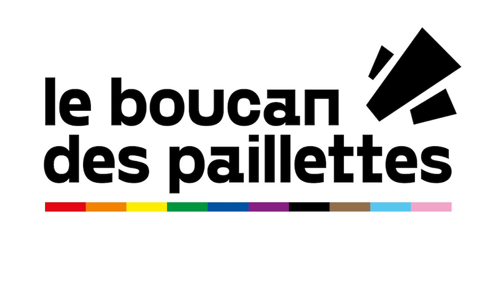

::: {style="text-align: center;"}

:::

# to do

-   misejour / vérif thèmes avec nouvelles réponses
-   changement couleurs graphiques

# Contexte

Ce sondage anonyme vise à faire l'état des lieux du fonctionnement du Boucan : vos ressentis et idées d'améliorations, il est purement informatif.

Ce sondage a été rédigé par la commision horizontalité du Boucan des Paillettes, après vote en plénière. Le contenu du sondage a été validé en plénière par les membres de l'association.

La commission horizontalité a été créée le 27/08/2025 en plénière afin d'animer un travail pour améliorer le fonctionnement du Boucan.

# Science ouverte et accessibilité

Le code (script R) permettant l'analyses des données est disponible [sur GitHub ici](https://github.com/SuzanneBonamour/sondage_boucan/tree/main).

Les données d'origine ne sont pas rendues accessible afin de respecter l'anonymat des répondant.es.

```{r echo=TRUE, include=FALSE}
library(tidytext)
library(readr)
library(tidyverse)
library(ggplot2)
library(stringr)
library(wordcloud)
library(textdata)
library(scales)
```

```{r echo=TRUE, include=FALSE}
dt1 <- read_delim("C:/Users/suzan/Documents/Boucan des Paillettes/Sondage/1) Data/results-survey648752(1).csv", 
    delim = ";", escape_double = FALSE, trim_ws = TRUE)
```

```{r echo=TRUE, include=FALSE}
dt2 <- dt1 %>% 
  select(-"lastpage. Dernière page", -"startlanguage. Langue de départ",
         -"seed. Tête de série", -"startdate. Date de lancement",
         -"datestamp. Date de la dernière action",
         -"submitdate. Date de soumission")

dt3 <- dt2 %>% 
  rename(id = `id. ID de la réponse`,
         temps_boucan = `Q372163. Depuis combien de temps avez-vous rejoint le Boucan ?`,
         combien_commission = `Q990553. Dans combien de commissions êtes-vous inscrit.e ?`,
         combien_commmision_actif = `Q793197. Dans combien de commissions êtes-vous réellement actif.ve ?`,
         freq_plen = `Q990552. A quelle fréquence venez-vous aux réunions plénières ?`,
         evol_invest = `Q990554. Votre investissement a-t-il évolué depuis votre adhésion ? Pourquoi ?`,
         evol_invest_com = `Q990554[comment]. Votre investissement a-t-il évolué depuis votre adhésion ? Pourquoi ? [Commentaire]`,
         evol_ressenti = `Q990555. Votre ressenti au sein de l’association a-t-il évolué depuis votre adhésion ?`,
         problem = `Q674946. Avez-vous rencontré des situations qui vous ont posé problème dans l’association ? `,
         problem_com = `Q674946[comment]. Avez-vous rencontré des situations qui vous ont posé problème dans l’association ?  [Commentaire]`,
         apport = `Q990556. Qu’est-ce que vous apporte le Boucan personnellement ?`,
         ajout_profil = `Q990557. Avez-vous des choses à ajouter sur votre profil au Boucan ?`,
         ressenti = `Q990558. Globalement, comment vous sentez-vous au sein de l'association?`,
         expression = `Q860601. Vous sentez-vous libre d’exprimer vos opinions ?`,
         ecoute = `Q625295. Vous sentez-vous écouté.e au Boucan ?`,
         inclusion = `Q295411. Vous sentez-vous facilement inclus.e au Boucan ?`,
         bienveillance = `Q630865. Avez-vous le sentiment d’avoir des interactions globalement bienveillantes ?`,
         bienetre_com = `Q990559. Avez-vous des choses à ajouter sur votre bien-être au Boucan ?`,
         accueil = `Q990560. Comment avez-vous trouvé l’accueil au Boucan ?`,
         accueil_com = `Q990560[comment]. Comment avez-vous trouvé l’accueil au Boucan ? [Commentaire]`,
         connaissance = `Q990561. Avez-vous une connaissance suffisante du fonctionnement du Boucan pour pouvoir facilement vous y impliquer, prendre des décisions, des responsabilités ?`,
         connaissance_com = `Q990561[comment]. Avez-vous une connaissance suffisante du fonctionnement du Boucan pour pouvoir facilement vous y impliquer, prendre des décisions, des responsabilités ? [Commentaire]`,
         plen_fonc = `Q483205. Trouvez-vous les réunions plénières fonctionnelles et efficaces ?`,
         plen_fonc_com = `Q990562. Vous pouvez vous exprimer ici sur le fonctionnement du Boucan si vous le souhaitez`,
         commission_fonc = `Q617401. Trouvez-vous les commissions globalement fonctionnelles et efficaces ?`,
         lien_commission_cc_plen = `Q595178. Pour les commissions : trouvez-vous fonctionnel le lien avec le Conseil Collégial et les réunions plénières ?`,
         ref_commision_fonc = `Q141881. Pour les commissions : trouvez-vous fonctionnel le rôle attribué aux référent.e.s de commissions ?`,
         orga_dans_commission_fonc = `Q915400. Pour les commissions : trouvez-vous fonctionnelle l'organisation au sein des commissions ?`,
         orga_dans_commission_fonc_com = `Q915400[comment]. Pour les commissions : trouvez-vous fonctionnelle l'organisation au sein des commissions ? [Commentaire]`,
         connaissance_envie_invest_dans_com = `Q253829. Pour les commissions : avez-vous une connaissance suffisante d’à quel point les personnes présentes souhaitent s’investir ?`,
         commission_fonc_com = `Q990563. Vous pouvez vous exprimer ici sur le fonctionnement des commissions si vous le souhaitez`,
         transparence_decision = `Q990564. Avez-vous l’impression que les prises de décision sont suffisamment transparentes ?`,
         transparence_argent = `Q610635. Avez-vous l’impression que la gestion de l’argent est suffisamment transparente ?`,
         horizontalite = `Q713862. Avez-vous le sentiment que la répartition du pouvoir et des responsabilités est équilibrée ?`,
         horizontalite_com = `Q990565. Avez-vous des choses à ajouter sur l'horizontalité au Boucan ?`,
         inclusion_queer = `Q990566. Sur votre identité queer : Est-ce que vous vous sentez inclus.e du fait de votre identité queer au sein du Boucan ?`,
         inclusion_intersectionnelle = `Q990567. Sur les autres discriminations, seulement pour les personnes concernées : Est-ce que vous vous sentez inclus.e du fait de votre identité intersectionnelle au sein du Boucan ?`,
         inclusion_com =`Q990568. Avez-vous des choses à ajouter sur l'inclusivité au Boucan ?`,
         idee_plen_fonc =`Q990569. Avez-vous des idées pour améliorer le fonctionnement des réunions plénières ?`,
         idee_commission_fonc = `Q427797. Avez-vous des idées pour améliorer le fonctionnement des commissions ? (Connaissance de l’investissement des autres, référent.e.s, lien entre le Conseil collégial et les réunions plénières...)`,
         idee_inclusion = `Q276480. Avez-vous des idées pour améliorer l’inclusion ?`,
         idee_horizontalite = `Q985032. Avez-vous des idées pour améliorer la prise de décision,  l’horizontalité et la répartition du pouvoir ?`,
         idee_transparence_argent = `Q353448. Avez-vous des idées pour améliorer la gestion de l’argent et/ou sa transparence ?`,
         idee_autre = `Q331405. Vous pouvez vous exprimer ici sur toute autre idée pour améliorer le fonctionnement au Boucan`)
```

# Nombre de réponses

```{r echo=TRUE, include=FALSE}
nb_rep = length(dt3$id)
```

Au total, `r prettyNum(nb_rep, big.mark = " ")` personnes ont répondu au sondage.

# Etat des lieux

```{r warning=FALSE}
#| include: false

colors_rainbow <- c("#750787", "#E40303", "#FF8C00", "#FFED00", "#008026", "#004DFF", "grey")
colors_rainbowlarge <- c("pink", "#750787", "#E40303", "#FF8C00", "#FFED00", "#008026", "#004DFF", "grey")
colors_rainbowlarge2 <- c("#E40303", "#750787","pink", "#FF8C00", "#FFED00", "#004DFF", "#008026", "grey")

colors_bm <- c("#008026", "#004DFF", "#FFED00", "#FF8C00", "#E40303", "grey")
colors_mb <- c("#E40303", "#FF8C00", "#FFED00", "#004DFF","#008026", "grey")
colors_mb3 <- c("#008026", "#FF8C00", "#E40303")
```

29 questions ont pour buts d'établir un état des lieux du fonctionnement de l'association et du bien-être des adhérents et bénévoles.

## Depuis combien de temps avez-vous rejoint le Boucan ?

```{r echo=FALSE, warning=FALSE}
# mise en forme du tableau pour l'histogramme
temps_boucan_dt <- as.data.frame(table(dt3$temps_boucan))

# calcul des frequences
temps_boucan_dt$Freq <- as.numeric(as.character(temps_boucan_dt$Freq))

# Définir l'ordre logique
ordre <- c("Moins de 6 mois",
           "Entre 6 mois et 1 an",
           "Entre 1 an et 1 an et demi",
           "Plus d'1 an et demi")

temps_boucan_dt$Var1 <- factor(temps_boucan_dt$Var1, levels = ordre)

# Calcul des pourcentages
temps_boucan_dt$pourcent <- round(temps_boucan_dt$Freq / sum(temps_boucan_dt$Freq) * 100)

# Graphique
ggplot(temps_boucan_dt, aes(x = Var1, y = Freq, fill = Var1)) +
  geom_bar(stat = "identity") +
  geom_text(aes(label = paste0(round(pourcent, 1), " %")),
            vjust = 2) +
  labs(x = "Durée", y = "Nombre de personnes",
       title = "") +
  # scale_fill_manual(values = rainbow(length(ordre))) +
  scale_fill_manual(values = colors_rainbow) +
  theme_minimal() +
  theme(axis.text.x = element_text(angle = 45, hjust = 1), legend.position = "none")
```

## Dans combien de commissions êtes-vous inscrit.e ?

```{r echo=FALSE, warning=FALSE}
# mise en forme du tableau pour l'histogramme
combien_commission_dt <- as.data.frame(table(dt3$combien_commission))

# calcul des frequences
combien_commission_dt$Freq <- as.numeric(as.character(combien_commission_dt$Freq))

# Définir toutes les modalités attendues
modalites <- c("1", "2", "3", "4", "5", "Non concerné.e")

# Transformer en facteur avec tous les niveaux
dt3$combien_commission <- factor(dt3$combien_commission, levels = modalites)

# Table avec toutes les modalités (même à 0)
combien_commission_dt <- as.data.frame(table(dt3$combien_commission))

# Renommer proprement
colnames(combien_commission_dt) <- c("Var1", "Freq")

# Calcul des pourcentages
combien_commission_dt$pourcent <- round(combien_commission_dt$Freq / sum(combien_commission_dt$Freq) * 100)

# Graphique
ggplot(combien_commission_dt, aes(x = Var1, y = Freq, fill = Var1)) +
  geom_bar(stat = "identity") +
  geom_text(aes(label = paste0(pourcent, " %")),
            vjust = -0.5) +
  # scale_fill_manual(values = rainbow(length(modalites))) +
  scale_fill_manual(values = colors_rainbow) +
  labs(x = "Dans combien de commision", y = "Nombre de personnes",
       title = "") +
  theme_minimal() +
  scale_y_continuous(limits = c(min(combien_commission_dt$Freq), 
                                max(combien_commission_dt$Freq + 2))) +
  theme(axis.text.x = element_text(angle = 45, hjust = 1),
        legend.position = "none")
```

## Dans combien de commissions êtes-vous réellement actif.ve ?

```{r echo=FALSE, warning=FALSE}
# mise en forme du tableau pour l'histogramme
combien_commmision_actif_dt <- as.data.frame(table(dt3$combien_commmision_actif))

# calcul des frequences
combien_commmision_actif_dt$Freq <- as.numeric(as.character(combien_commmision_actif_dt$Freq))

# Définir toutes les modalités attendues
modalites <- c("1", "2", "3", "4", "5", "Non concerné.e")

# Transformer en facteur avec tous les niveaux
dt3$combien_commmision_actif <- factor(dt3$combien_commmision_actif, levels = modalites)

# Table avec toutes les modalités (même à 0)
combien_commmision_actif_dt <- as.data.frame(table(dt3$combien_commmision_actif))

# Renommer proprement
colnames(combien_commmision_actif_dt) <- c("Var1", "Freq")

# Calcul des pourcentages
combien_commmision_actif_dt$pourcent <- round(combien_commmision_actif_dt$Freq / sum(combien_commmision_actif_dt$Freq) * 100)

# Graphique
ggplot(combien_commmision_actif_dt, aes(x = Var1, y = Freq, fill = Var1)) +
  geom_bar(stat = "identity") +
  geom_text(aes(label = paste0(pourcent, " %")),
            vjust = -0.5) +
  scale_fill_manual(values = colors_rainbow) +
  labs(x = "Dans combien de être vous en tant que membre actif.ve", y = "Nombre de personnes",
       title = "") +
  theme_minimal() +
  scale_y_continuous(limits = c(min(combien_commmision_actif_dt$Freq), 
                                max(combien_commmision_actif_dt$Freq + 2))) +
  theme(axis.text.x = element_text(angle = 45, hjust = 1),
        legend.position = "none")
```

## A quelle fréquence venez-vous aux réunions plénières ?

```{r echo=FALSE, warning=FALSE}
# mise en forme du tableau pour l'histogramme
freq_plen_dt <- as.data.frame(table(dt3$freq_plen))

# Définir l'ordre logique
ordre <- c("Entre 2 et zéro par an",
           "Quelques unes dans l'année",
           "Environ la moitié",
           "Toutes ou la plupart")

# calcul des frequences
freq_plen_dt$Freq <- as.numeric(as.character(freq_plen_dt$Freq))

# mettre dans le bon ordre l'axe des x
freq_plen_dt$Var1 <- factor(freq_plen_dt$Var1, levels = ordre)

# Renommer proprement
colnames(freq_plen_dt) <- c("Var1", "Freq")

# Calcul des pourcentages
freq_plen_dt$pourcent <- round(freq_plen_dt$Freq / sum(freq_plen_dt$Freq) * 100)

# Graphique
ggplot(freq_plen_dt, aes(x = Var1, y = Freq, fill = Var1)) +
  geom_bar(stat = "identity") +
  geom_text(aes(label = paste0(pourcent, " %")),
            vjust = -0.5) +
  scale_fill_manual(values = rev(colors_mb)) +
  labs(x = "Fréquence de présence en plénière", y = "Nombre de personnes",
       title = "") +
  theme_minimal() +
  # scale_y_continuous(limits = c(min(freq_plen_dt$Freq),
  #                               max(freq_plen_dt$Freq + 2))) +
  expand_limits(y = max(freq_plen_dt$Freq) + 1) +
  theme(axis.text.x = element_text(angle = 45, hjust = 1),
        legend.position = "none")
```

## Votre investissement a-t-il évolué depuis votre adhésion ? Pourquoi ?

```{r echo=FALSE, warning=FALSE}
# # mise en forme du tableau pour l'histogramme
# evol_invest_dt <- as.data.frame(table(dt3$evol_invest))
# 
# # calcul des frequences
# evol_invest_dt$Freq <- as.numeric(as.character(evol_invest_dt$Freq))
# 
# # Définir toutes les modalités attendues
# modalites <- c("1", "2", "3", "4", "5", "Non concerné.e")
# 
# # Transformer en facteur avec tous les niveaux
# dt3$evol_invest <- factor(dt3$evol_invest, levels = modalites)
# 
# # Table avec toutes les modalités (même à 0)
# evol_invest_dt <- as.data.frame(table(dt3$evol_invest))
# 
# # Renommer proprement
# colnames(evol_invest_dt) <- c("Var1", "Freq")
# 
# # Calcul des pourcentages
# evol_invest_dt$pourcent <- round(evol_invest_dt$Freq / sum(evol_invest_dt$Freq) * 100)
# 
# # Graphique
# ggplot(evol_invest_dt, aes(x = Var1, y = Freq, fill = Var1)) +
#   geom_bar(stat = "identity") +
#   geom_text(aes(label = paste0(pourcent, " %")),
#             vjust = -0.5) +
#   scale_fill_manual(values = rainbow(length(modalites))) +
#   labs(x = "evol_invest", y = "Nombre de personnes",
#        title = "") +
#   theme_minimal() +
#   scale_y_continuous(limits = c(min(evol_invest_dt$Freq), max(evol_invest_dt$Freq + 2))) +
#   theme(axis.text.x = element_text(angle = 45, hjust = 1),
#         legend.position = "none")
```

```{r echo=FALSE, warning=FALSE}
# ---- 1. Données ----
evol_invest_com_dt1 <- dt3 %>%
  filter(!is.na(evol_invest_com)) %>%
  select(id, evol_invest, evol_invest_com)

nb_rep_evol_invest_com = length(evol_invest_com_dt1$evol_invest_com)
```

`r nb_rep_evol_invest_com` commentaires ont été écrits pour cette rubrique.

```{r echo=FALSE, warning=FALSE}
apport_dt2 <- evol_invest_com_dt1 %>%
  mutate(
    evolution = case_when(
      str_detect(str_to_lower(evol_invest_com),
                 "mieux|repris|réinvest|davantage|augmentation|de plus en plus ") ~ "Augmentation",

      str_detect(str_to_lower(evol_invest_com),
                 "pas d'évolution|stable|n'a pas changé|inchangé|ne change pas|
Pas eu la possibilité") ~ "Stable",
      str_detect(str_to_lower(evol_invest_com),
                 "bais|diminu|désinvest|moins|épuis|fatigu|burn|manque de temps|pas assez|plus dispo|arrêt|peu|municipale|interpersonnelles|	venir|manque|ne se réunit plus") ~ "Diminution",
      str_detect(str_to_lower(evol_invest_com),
                       "venir") ~ "Diminution",
      str_detect(str_to_lower(evol_invest_com),
                 "Plus de disponibilité") ~ "Non classé",
      str_detect(str_to_lower(evol_invest_com),
                 "variable") ~ "Fluctuant",
      TRUE ~ "Non classé"
    )
  )

evol_counts <- apport_dt2 %>%
  count(evolution, sort = TRUE) %>%
  mutate(
    evolution = factor(evolution,
      levels = c("Augmentation", "Fluctuant", "Stable", "Diminution", "Non classé")
    )
  )

cols_evol <- c(
  "Augmentation" = "#008026",
  "Fluctuant"    = "#FFED00",
  "Stable"       = "#004DFF",
  "Diminution"   = "#E40303",
  "Non classé"   = "grey"
)

ggplot(evol_counts,
       aes(x = evolution,
           y = n,
           fill = evolution)) +
  geom_col() +
  coord_flip() +
  labs(
    title = "",
    x = "",
    y = "Nombre de personnes"
  ) +
  scale_fill_manual(values = cols_evol) +
  theme_minimal(base_size = 12) +
  theme(
    legend.position = "none",
    plot.title = element_text(face = "bold")
  )
```

Pourquoi l'investissement diminue ?

| Thème                          | Mots-clés associés                                                         |
|---------------------|--------------------------------------------------|
| Fatigue / burn-out             | fatigu, épuis, burn, désinvest, manque d'énergie                           |
| Commissions peu actives        | peu actives, ne se réunit plus                                             |
| Manque de disponibilité        | temps, agenda, activité, soir, disponibil, municipal, possibilité de venir |
| Problèmes organisationnels     | autonomie, long, compliqué                                                 |
| Tensions relationnelles        | tension, conflit, relation, interperson, contrôle                          |
| Charge collective insuffisante | plus assez de personnes, charge, porter, seul                              |

```{r echo=FALSE, warning=FALSE}
diminution_dt <- apport_dt2 %>%
  filter(evolution == "Diminution")

diminution_dt <- diminution_dt %>%
  mutate(
    themes_diminution = map(evol_invest_com, function(txt) {

      txt <- str_to_lower(txt)

      detected <- c(
        if (str_detect(txt, "fatigu|épuis|burn|désinvest|manque d'énergie"))
          "Fatigue / burn-out",

        if (str_detect(txt, "peu actives|ne se réunit plus"))
          "Commissions peu actives",
        
        if (str_detect(txt, "temps|agenda|activité|soir|disponibil|municipal|possibilité de venir"))
          "Manque de disponibilité",
        
        if (str_detect(txt, "autonomie|long|compliqué"))
          "Problèmes organisationnels au sein de l'asso",

        if (str_detect(txt, "tension|conflit|relation|interperson|contrôle"))
          "Tensions relationnelles",

        if (str_detect(txt, "plus assez de personnes|charge|porter|seul"))
          "Charge collective insuffisante"
      )

      detected <- unique(detected)

      if (length(detected) == 0) "Autre" else detected
    })
  )

themes_long <- diminution_dt %>%
  unnest(themes_diminution)

theme_counts <- themes_long %>%
  count(themes_diminution, sort = TRUE)

themes_long <- themes_long %>%
  mutate(
    themes_diminution = factor(themes_diminution,
      levels = c(
        "Fatigue / burn-out",
        "Manque de disponibilité",
        "Problèmes organisationnels au sein de l'asso",
        "Charge collective insuffisante",
        "Tensions relationnelles",
        "Autre"
      )
    )
  )

colors_rainbowlarge <- c(
  "Fatigue / burn-out"              = "#E40303",
  "Manque de disponibilité"            = "#004DFF",
  "Problèmes organisationnels au sein de l'asso"      = "#750787",
  "Charge collective insuffisante"  = "#FFED00",
  "Tensions relationnelles"         = "#FF8C00",
  "Autre"                          = "grey"
)

ggplot(theme_counts,
       aes(x = reorder(themes_diminution, n),
           y = n,
           fill = themes_diminution)) +
  geom_col() +
  coord_flip() +
  labs(
    title = "",
    x = "",
    y = "Nombre de réponses"
  ) +
  scale_fill_manual(values = colors_rainbowlarge) +
  theme_minimal(base_size = 12) +
  theme(
    legend.position = "none",
    plot.title = element_text(face = "bold")
  )
```

Extraits choisis :

- *"Tensions interpersonnelles qui éclaboussent même les personnes qui n'y sont pas mêlées"*
- *"Le manque de liberté d'action et d'autonomie me freine"*
- *"Il y a un besoin de contrôle qui fait que tout est si long et compliqué"*

```{r echo=FALSE, eval=FALSE, warning=FALSE}
## Votre ressenti au sein de l’association a-t-il évolué depuis votre adhésion ?

# mise en forme du tableau pour l'histogramme
evol_ressenti_dt <- as.data.frame(table(dt3$evol_ressenti))

# calcul des frequences
evol_ressenti_dt$Freq <- as.numeric(as.character(evol_ressenti_dt$Freq))

# Définir toutes les modalités attendues
modalites <- c("1", "2", "3", "4", "5", "Non concerné.e")

# Transformer en facteur avec tous les niveaux
dt3$evol_ressenti <- factor(dt3$evol_ressenti, levels = modalites)

# Table avec toutes les modalités (même à 0)
evol_ressenti_dt <- as.data.frame(table(dt3$evol_ressenti))

# Renommer proprement
colnames(evol_ressenti_dt) <- c("Var1", "Freq")

# Calcul des pourcentages
evol_ressenti_dt$pourcent <- round(evol_ressenti_dt$Freq / sum(evol_ressenti_dt$Freq) * 100)

# Graphique
ggplot(evol_ressenti_dt, aes(x = Var1, y = Freq, fill = Var1)) +
  geom_bar(stat = "identity") +
  geom_text(aes(label = paste0(pourcent, " %")),
            vjust = -0.5) +
  scale_fill_manual(values = colors_mb) +
  labs(x = "evol_ressenti", y = "Nombre de personnes",
       title = "") +
  theme_minimal() +
  scale_y_continuous(limits = c(min(evol_ressenti_dt$Freq), max(evol_ressenti_dt$Freq + 2))) +
  theme(axis.text.x = element_text(angle = 45, hjust = 1),
        legend.position = "none")
```

## Avez-vous rencontré des situations qui vous ont posé problème dans l'association ?

```{r echo=FALSE, warning=FALSE}
# mise en forme du tableau pour l'histogramme
problem_dt <- as.data.frame(table(dt3$problem))

# calcul des frequences
problem_dt$Freq <- as.numeric(as.character(problem_dt$Freq))

# Définir toutes les modalités attendues
modalites <- c("Non", "Oui, une fois", "Oui, plusieurs fois")

# Transformer en facteur avec tous les niveaux
dt3$problem <- factor(dt3$problem, levels = modalites)

# Table avec toutes les modalités (même à 0)
problem_dt <- as.data.frame(table(dt3$problem))

# Renommer proprement
colnames(problem_dt) <- c("Var1", "Freq")

# Calcul des pourcentages
problem_dt$pourcent <- round(problem_dt$Freq / sum(problem_dt$Freq) * 100)

# Graphique
ggplot(problem_dt, aes(x = Var1, y = Freq, fill = Var1)) +
  geom_bar(stat = "identity") +
  geom_text(aes(label = paste0(pourcent, " %")),
            vjust = -0.5) +
  scale_fill_manual(values = colors_mb3) +
  labs(x = "Expérience problématique", y = "Nombre de personnes",
       title = "") +
  theme_minimal() +
  # scale_y_continuous(limits = c(min(problem_dt$Freq), max(problem_dt$Freq + 2))) +
  expand_limits(y = max(freq_plen_dt$Freq) + 5) +
  theme(axis.text.x = element_text(angle = 45, hjust = 1),
        legend.position = "none")
```

### Commentaires

```{r echo=FALSE, warning=FALSE}
problem_com_dt1 <- dt3 %>%
  filter(!is.na(problem_com)) %>%
  select(id, problem_com) 

nb_rep_problem_com = length(problem_com_dt1$problem_com)
```

`r nb_rep_problem_com` commentaires ont été écrits pour cette rubrique.

Thèmes :

| Thème                               | Mots-clés associés                                                                                     |
|-------------------|-----------------------------------------------------|
| Conflit relationnel                 | agressif, houleux, conflit, débat, tension, affect, interpersonnel, irrespect, altercation, ordre, sec |
| Manipulation                        | gaslighting                                                                                            |
| Inclusivité / écoute                | écouté, légitime, inclusif, activant, trans, blanche, effacé, cis                                      |
| Gouvernance                         | dirigiste, transparence, conseil, paralysé, collégial, descendant, employé, responsable                |
| Manque de connaissance / expérience | comprendre, culture, expérience                                                                        |
| Commentaire positif                 | table                                                                                                  |
| Surcharge de travail                | épuisement                                                                                             |

```{r echo=FALSE, warning=FALSE}
problem_com_dt2 <- problem_com_dt1 %>%
  mutate(
    themes = map(problem_com, function(txt) {
      
      detected <- c(
        if (str_detect(txt, "agressif|houleus|conflit|tension|affect|interpersonnel|irrespect|altercation|ordre|sec"))
          "Conflit relationnel",
        
        if (str_detect(txt, "gasligh"))
          "Manipulation",
        
        if (str_detect(txt, "écouté|légitime|inclusiv|activant|trans|blanche|effac|cis"))
          "Inclusivité / écoute",
        
        if (str_detect(txt, "dirigiste|transparence|conseil|paralyse|collégial|descendant|employé|responsable"))
          "Gouvernance",
        
        if (str_detect(txt, "comprendre|culture|expérience"))
          "Manque de connaissance / d'expérience",
        
        if (str_detect(txt, "table"))
          "Commentaire positif",
        
        if (str_detect(txt, "épuisement"))
          "Surcharge de travail"
      )
      
      detected <- unique(detected)
      
      if (length(detected) == 0) "Autre" else detected
    })
  )

# ---- 2. Explosion ----
themes_long <- problem_com_dt2 %>%
  unnest(themes)

# ---- 3. Comptages ----
theme_counts <- themes_long %>%
  count(themes, sort = TRUE)


themes_long <- themes_long %>%
  mutate(
    themes = factor(themes,
                    levels = c(
                      "Conflit relationnel",
                      "Manipulation",
                      "Inclusivité / écoute",
                      "Gouvernance",
                      "Compréhension / expérience",
                      "Surcharge de travail",
                      "Manque de connaissance / d'expérience",
                      "Commentaire positif",
                      "Autre"
                    ))
  )

# colors_rainbowlarge <- c(
#   "Conflit relationnel"        = "#FF8C00",
#   "Manipulation"               = "#E40303",
#   "Inclusivité / écoute"       = "#750787",
#   "Gouvernance"                = "#FFED00",
#   "Compréhension / expérience" = "#004DFF",
#   "Surcharge de travail"       = "black",
#   "Manque de connaissance / d'expérience" = "pink",
#   "Commentaire positif"        = "#008026",
#   "Autre"                      = "grey"
# )

ggplot(theme_counts,
       aes(x = reorder(themes, n),
           y = n,
           fill = themes)) +
  geom_col() +
  coord_flip() +
  labs(
    title = "",
    x = "",
    y = "Nombre de citations"
  ) +
  scale_fill_manual(values = colors_rainbowlarge) +
  theme_minimal() +
  theme(legend.position = "none")
```

Extraits choisis :

- *"Il y a eu un debat sur le tour de pronoms que j'ai trouvé très activant et irrespectueux des personnes trans"*
- *"La vibe générale du Boucan comme un espace plutot cis et blanc m'ont donné beaucoup moins envie de m'investir"*

## Qu'est-ce que vous apporte le Boucan personnellement ?

```{r echo=FALSE, warning=FALSE}
# ---- 1. Données ----
apport_dt1 <- dt3 %>%
  filter(!is.na(apport)) %>%
  select(id, apport)

nb_rep_apport = length(apport_dt1$apport)
```

`r nb_rep_apport` commentaires ont été écrits pour cette rubrique.

| Thème                                        | Mots-clés associés                                                                      |
|-------------------------|-----------------------------------------------|
| Communauté / appartenance                    | communauté, entre personnes, espace queer, espace, collectivement                       |
| Soutien / bien-être                          | bien-être, rassurant, réconfort, soutien, espoir, réponse, joyeuse                      |
| Engagement militant                          | milit, droits, lutter, fascisme, cause, pas de droite, intersectionnel, défense, valeur |
| Rencontres / sociabilité                     | rencontre, convivial, sociabilis, ami, moment                                           |
| Activités / événements                       | événement, festif                                                                       |
| Implication / participation                  | impliquer, investi, contribuer, adhésion, agir, action, projet, participer              |
| Existence de l'association en tant que telle | existe, présence                                                                        |

```{r echo=FALSE, warning=FALSE}
# ---- 1. Détection des thèmes ----
apport_dt2 <- apport_dt1 %>%
  mutate(
    themes = map(apport, function(txt) {
      
      txt <- str_to_lower(txt)
      
      detected <- c(
        if (str_detect(txt, "communauté|entre personnes|espace queer|espace|collectivement"))
          "Communauté / appartenance",
        
        if (str_detect(txt, "bien[- ]?être|rassurant|réconfort|soutien|espoir|réponse|joyeuse"))
          "Soutien / bien-être",
        
        if (str_detect(txt, "milit|droits|lutter|fascisme|cause|pas de droite|intersectionnel|défense|valeur"))
          "Engagement militant",
        
        if (str_detect(txt, "rencontre|convivial|sociabilis|ami|moment"))
          "Rencontres / sociabilité",
        
        if (str_detect(txt, "événement|festif"))
          "Activités / événements",
        
        if (str_detect(txt, "impliquer|investi|contribuer|adhésion|agir|action|agir|projet|participer"))
          "Implication / participation",
        
        if (str_detect(txt, "existe|présence"))
          "Existence de l'association en tant que telle"
      )
      
      detected <- unique(detected)
      
      if (length(detected) == 0) "Autre" else detected
    })
  )

# ---- 2. Explosion ----
themes_long <- apport_dt2 %>%
  unnest(themes)

# ---- 3. Comptages ----
theme_counts <- themes_long %>%
  count(themes, sort = TRUE)

# ---- 4. Ordre ----
themes_long <- themes_long %>%
  mutate(
    themes = factor(themes,
                    levels = c(
                      "Communauté / appartenance",
                      "Soutien / bien-être",
                      "Engagement militant",
                      "Rencontres / sociabilité",
                      "Activités / événements",
                      "Implication / participation",
                      "Existence de l'association en tant que telle",
                      "Autre"
                    ))
  )

# ---- 5. Palette cohérente (positif = vert/bleu) ----
# colors_rainbowlarge <- c(
#   "Communauté / appartenance"   = "pink",  # vert
#   "Soutien / bien-être"         = "#750787",  # vert clair
#   "Rencontres / sociabilité"    = "#E40303",  # bleu
#   "Engagement militant"         = "#FF8C00",  # rouge (engagement / lutte)
#   "Implication / participation" = "#FFED00",  # violet
#   "Activités / événements"      = "#008026",  # orange
#   "Existence de l'association en tant que telle"   = "#004DFF",
#   "Autre" = "grey"
# )

colors_rainbowlarge <- c("pink", "#750787", "#E40303", "#FF8C00", "#FFED00", "#008026", "#004DFF", "grey")
colors_rainbowlarge2 <- c("#E40303", "#750787","pink", "#FF8C00", "#FFED00", "#004DFF", "#008026", "grey")

# ---- 6. Graphique ----
ggplot(theme_counts,
       aes(x = reorder(themes, n),
           y = n,
           fill = themes)) +
  geom_col() +
  coord_flip() +
  labs(
    title = "Qu'est-ce que vous apporte le Boucan ?",
    x = "",
    y = "Nombre de citations"
  ) +
  scale_fill_manual(values = colors_rainbowlarge2) +
  theme_minimal() +
  theme(legend.position = "none")
```

## Globalement, comment vous sentez-vous au sein de l'association ?

```{r echo=FALSE, warning=FALSE}
# mise en forme du tableau pour l'histogramme
ressenti_dt <- as.data.frame(table(dt3$ressenti))

# calcul des frequences
ressenti_dt$Freq <- as.numeric(as.character(ressenti_dt$Freq))

# Définir toutes les modalités attendues
modalites <- c("1", "2", "3", "4", "5", "Non concerné.e")

# Transformer en facteur avec tous les niveaux
dt3$ressenti <- factor(dt3$ressenti, levels = modalites)

# Table avec toutes les modalités (même à 0)
ressenti_dt <- as.data.frame(table(dt3$ressenti))

# Renommer proprement
colnames(ressenti_dt) <- c("Var1", "Freq")

# Calcul des pourcentages
ressenti_dt$pourcent <- round(ressenti_dt$Freq / sum(ressenti_dt$Freq) * 100)

# Graphique
ggplot(ressenti_dt, aes(x = Var1, y = Freq, fill = Var1)) +
  geom_bar(stat = "identity") +
  geom_text(aes(label = paste0(pourcent, " %")),
            vjust = -0.5) +
  scale_fill_manual(values = colors_mb) +
  labs(x = "Comment vous sentez-vous au sein de l'association ?", y = "Nombre de personnes",
       title = "") +
  theme_minimal() +
  scale_y_continuous(limits = c(min(ressenti_dt$Freq), max(ressenti_dt$Freq + 0.5))) +
  theme(axis.text.x = element_text(angle = 45, hjust = 1),
        legend.position = "none")
```

## Vous sentez-vous libre d'exprimer vos opinions ?

```{r echo=FALSE, warning=FALSE}
# mise en forme du tableau pour l'histogramme
expression_dt <- as.data.frame(table(dt3$expression))

# calcul des frequences
expression_dt$Freq <- as.numeric(as.character(expression_dt$Freq))

# Calcul des pourcentages
expression_dt$pourcent <- round(expression_dt$Freq / sum(expression_dt$Freq) * 100)

# Graphique
ggplot(expression_dt, aes(x = Var1, y = Freq, fill = Var1)) +
  geom_bar(stat = "identity") +
  geom_text(aes(label = paste0(round(pourcent, 1), " %")),
            vjust = -0.5) +
  labs(x = "Vous sentez-vous libre d'exprimer vos opinions ?", y = "Nombre de personnes",
       title = "") +
  scale_y_continuous(breaks = seq(0, max(expression_dt$Freq), by = 2),
                     limits = c(0,9.5)) +
  scale_fill_manual(values = colors_mb) +
  theme_minimal() +
  theme(axis.text.x = element_text(angle = 45, hjust = 1), legend.position = "none")
```

## Vous sentez-vous écouté.e au Boucan ?

```{r echo=FALSE, warning=FALSE}
# mise en forme du tableau pour l'histogramme
inclusion_dt <- as.data.frame(table(dt3$inclusion))

# calcul des frequences
inclusion_dt$Freq <- as.numeric(as.character(inclusion_dt$Freq))

# Calcul des pourcentages
inclusion_dt$pourcent <- round(inclusion_dt$Freq / sum(inclusion_dt$Freq) * 100)

# Graphique
ggplot(inclusion_dt, aes(x = Var1, y = Freq, fill = Var1)) +
  geom_bar(stat = "identity") +
  geom_text(aes(label = paste0(round(pourcent, 1), " %")),
            vjust = 2) +
  labs(x = "Vous sentez-vous écouté.e au Boucan ?", y = "Nombre de personnes",
       title = "") +
  # scale_y_continuous(breaks = seq(0, max(inclusion_dt$Freq), by = 1)) +
  # scale_fill_manual(values = rainbow(length(inclusion_dt$Var1))) +
  scale_y_continuous(breaks = seq(0, max(inclusion_dt$Freq), by = 2),
                     limits = c(0,7.5)) +
  scale_fill_manual(values = colors_mb) +
  theme_minimal() +
  theme(axis.text.x = element_text(angle = 45, hjust = 1), legend.position = "none")
```

## Vous sentez-vous facilement inclus.e au Boucan ?

```{r echo=FALSE, warning=FALSE}
# mise en forme du tableau pour l'histogramme
ecoute_dt <- as.data.frame(table(dt3$ecoute))

# calcul des frequences
ecoute_dt$Freq <- as.numeric(as.character(ecoute_dt$Freq))

# Calcul des pourcentages
ecoute_dt$pourcent <- round(ecoute_dt$Freq / sum(ecoute_dt$Freq) * 100)

# Graphique
ggplot(ecoute_dt, aes(x = Var1, y = Freq, fill = Var1)) +
  geom_bar(stat = "identity") +
  geom_text(aes(label = paste0(round(pourcent, 1), " %")),
            vjust = 2) +
  labs(x = "Vous sentez-vous inclus.e ?", y = "Nombre de personnes",
       title = "") +
  scale_y_continuous(breaks = seq(0, max(ecoute_dt$Freq), by = 2),
                     limits = c(0,11)) +
  scale_fill_manual(values = colors_mb) +
  theme_minimal() +
  theme(axis.text.x = element_text(angle = 45, hjust = 1), legend.position = "none")
```

## Avez-vous le sentiment d'avoir des interactions globalement bienveillantes ?

```{r echo=FALSE, warning=FALSE}
# mise en forme du tableau pour l'histogramme
bienveillance_dt <- as.data.frame(table(dt3$bienveillance))

# calcul des frequences
bienveillance_dt$Freq <- as.numeric(as.character(bienveillance_dt$Freq))

# Définir toutes les modalités attendues
modalites <- c("1", "2", "3", "4", "5", "Non concerné.e")

# Transformer en facteur avec tous les niveaux
dt3$bienveillance <- factor(dt3$bienveillance, levels = modalites)

# Table avec toutes les modalités (même à 0)
bienveillance_dt <- as.data.frame(table(dt3$bienveillance))

# Renommer proprement
colnames(bienveillance_dt) <- c("Var1", "Freq")

# Calcul des pourcentages
bienveillance_dt$pourcent <- round(bienveillance_dt$Freq / sum(bienveillance_dt$Freq) * 100)

# Graphique
ggplot(bienveillance_dt, aes(x = Var1, y = Freq, fill = Var1)) +
  geom_bar(stat = "identity") +
  geom_text(aes(label = paste0(pourcent, " %")),
            vjust = -0.5) +
  labs(x = "Avez-vous le sentiment d'avoir des interactions bienveillantes ?", y = "Nombre de personnes",
       title = "") +
  theme_minimal() +
  scale_y_continuous(breaks = seq(0, max(bienveillance_dt$Freq), by = 2),
                     limits = c(0,14)) +
  scale_fill_manual(values = colors_mb) +
  theme(axis.text.x = element_text(angle = 45, hjust = 1),
        legend.position = "none")
```

## Avez-vous des choses à ajouter sur votre bien-être au Boucan ?

```{r echo=FALSE, warning=FALSE}
be_dt1 <- dt3 %>%
  filter(!is.na(bienetre_com)) %>%
  select(id, bienetre_com) %>% 
  filter(!bienetre_com=="Non")

nb_rep_be = length(be_dt1$bienetre_com)
```

`r nb_rep_be` commentaires ont été écrits pour cette rubrique.

```{r echo=FALSE, warning=FALSE}
# ---- 1. Création des variables ----
be_dt2 <- be_dt1 %>%
  mutate(
    be_positif_negatif = case_when(
      str_detect(bienetre_com, "écoute|soin|bienveillance|apprécie|merci") ~ "Positif",
      str_detect(bienetre_com, "dommage|difficile|blessant|tension|agressivit|conflit|hostilit|critiqu|droite|dégrad") ~ "Négatif",
      TRUE ~ "Neutre"
    ),
    be_detail = case_when(
      str_detect(bienetre_com, "tension|agressivit|conflit|hostilit|critiqu") ~ "Conflit",
      str_detect(bienetre_com, "écoute|soin|bienveillance|apprécie|merci") ~ "Positif",
      str_detect(bienetre_com, "difficile|blessant|dégrad") ~ "Négatif",
      TRUE ~ "Autre"
    )
  )

# ---- 2. Forcer un ordre logique ----
be_dt2 <- be_dt2 %>%
  mutate(
    be_positif_negatif = factor(be_positif_negatif,
                                levels = c("Positif", "Neutre", "Négatif")),
    be_detail = factor(be_detail,
                       levels = c("Positif", "Conflit", "Négatif", "Autre"))
  )

# ---- 3. Comptages ----
be_positif_negatif_counts <- be_dt2 %>%
  count(be_positif_negatif, sort = TRUE)

be_detail_counts <- be_dt2 %>%
  count(be_detail, sort = TRUE)

# ---- 4. Palettes de couleurs ----

# Sentiment (couleurs métier claires)
# cols_sentiment <- c(
#   "Positif" = "green",
#   "Neutre"  = "grey70",
#   "Négatif" = "red"
# )

# Thèmes (rainbow contrôlé + overrides)
# base_cols <- rainbow(length(levels(be_dt2$be_detail)))
# 
# cols_detail <- setNames(base_cols, levels(be_dt2$be_detail))
# 
# # Override pour garder du sens
# cols_detail["Positif"] <- "green"
# cols_detail["Conflit"] <- "red"
# cols_detail["Négatif"] <- "orange"
# cols_detail["Autre"]   <- "grey70"

# ---- 5. Graphique sentiment ----
# ggplot(be_positif_negatif_counts,
#        aes(x = reorder(be_positif_negatif, n),
#            y = n,
#            fill = be_positif_negatif)) +
#   geom_col() +
#   coord_flip() +
#   labs(
#     title = "Avez-vous des choses à ajouter sur votre bien-être au Boucan ? Sentiments",
#     x = "",
#     y = "Nombre de réponses"
#   ) +
#   scale_fill_manual(values = colors_bm) +
#   theme_minimal() +
#   theme(legend.position = "none")

# ---- 6. Graphique thèmes ----
ggplot(be_detail_counts,
       aes(x = reorder(be_detail, n),
           y = n,
           fill = be_detail)) +
  geom_col() +
  coord_flip() +
  labs(
    title = "Avez-vous des choses à ajouter sur votre bien-être au Boucan ?",
    x = "",
    y = "Nombre de réponses"
  ) +
  scale_fill_manual(values = colors_bm) +
  theme_minimal() +
  theme(legend.position = "none")
```

## Comment avez-vous trouvé l'accueil au Boucan ?

```{r echo=FALSE, warning=FALSE}
# mise en forme du tableau pour l'histogramme
accueil_dt <- as.data.frame(table(dt3$accueil))

# calcul des frequences
accueil_dt$Freq <- as.numeric(as.character(accueil_dt$Freq))

# Définir toutes les modalités attendues
modalites <- c("1", "2", "3", "4", "5", "Non concerné.e")

# Transformer en facteur avec tous les niveaux
dt3$accueil <- factor(dt3$accueil, levels = modalites)

# Table avec toutes les modalités (même à 0)
accueil_dt <- as.data.frame(table(dt3$accueil))

# Renommer proprement
colnames(accueil_dt) <- c("Var1", "Freq")

# Calcul des pourcentages
accueil_dt$pourcent <- round(accueil_dt$Freq / sum(accueil_dt$Freq) * 100)

# Graphique
ggplot(accueil_dt, aes(x = Var1, y = Freq, fill = Var1)) +
  geom_bar(stat = "identity") +
  geom_text(aes(label = paste0(pourcent, " %")),
            vjust = -0.5) +
  scale_fill_manual(values = colors_mb) +
  labs(x = "Comment avez-vous trouvé l'accueil ?", y = "Nombre de personnes",
       title = "") +
  theme_minimal() +
  scale_y_continuous(limits = c(0,
                                max(accueil_dt$Freq) + 0.5),
                       breaks = seq(0, 100, by = 1)) +
  theme(axis.text.x = element_text(angle = 45, hjust = 1),
        legend.position = "none")
```

### Commentaires

```{r echo=FALSE, warning=FALSE}
accueil_com_dt1 <- dt3 %>%
  filter(!is.na(accueil_com)) %>%
  select(id, accueil_com) 

nb_rep_accueil_com= length(accueil_com_dt1$accueil_com)
```

`r nb_rep_accueil_com` commentaires ont été écrits pour cette rubrique.

| Thème                             | Mots-clés associés                                                                                                    |
|------------------|------------------------------------------------------|
| Procédure d'accueil absente       | accueil, livret                                                                                                       |
| Compréhension de l'organisation   | comprendre, fonctionnement, organisation, fonctionner                                                                 |
| Isolement des nouvelles personnes | seul, isolé, difficile, compliqué, arrivée, nouveau, intégration, impersonnel, relation, contact, personne, rencontré |
| Accueil positif                   | bon accueil, humain, bien, positif                                                                                    |

```{r echo=FALSE, warning=FALSE}
# ---- 1. Catégorisation des verbatims ----
accueil_com_dt2 <- accueil_com_dt1 %>%
  mutate(
    themes = map(accueil_com, function(txt) {
      
      detected <- c(
        
        if (str_detect(txt, "accueil|livret"))
          "Pas de procédure d'acceuil",
        
        if (str_detect(txt, "comprendre|fonctionnement|organisation|fonctionner"))
          "Compréhension de l'organisation",
        
        if (str_detect(txt, "seul|isolé|difficile|compliqué|arrivée|nouveau|intégration|impersonnel|relation|contact|personne|rencontré"))
          "Isolement des nouvelleaux / Manque de lien social",
        
        if (str_detect(txt, "bon accueil|humain|bien|positif"))
          "Accueil positif"
      )
      
      detected <- unique(detected)
      
      if (length(detected) == 0) "Autre" else detected
    })
  )

# ---- 2. Explosion des thèmes ----
themes_long <- accueil_com_dt2 %>%
  unnest(themes)

# ---- 3. Comptage ----
theme_counts <- themes_long %>%
  count(themes, sort = TRUE)

# ---- 4. Ordre des catégories ----
themes_long <- themes_long %>%
  mutate(
    themes = factor(themes,
      levels = c(
        "Pas de procédure d'acceuil",
        "Compréhension de l'organisation",
        "Isolement des nouvelleaux / Manque de lien social",
        "Accueil positif",
        "Autre"
      )
    )
  )

# ---- 6. Graphique ----
ggplot(theme_counts,
       aes(x = reorder(themes, n),
           y = n,
           fill = themes)) +
  geom_col() +
  coord_flip() +
  labs(
    title = "Comment avez-vous trouvé l'accueil ? Commentaires",
    x = "",
    y = "Nombre de citations"
  ) +
  scale_fill_manual(values = colors_rainbowlarge) +
  theme_minimal() +
  theme(legend.position = "none")
```

Extraits choisis :

-   *"Il n'y a pas de moments d'accueil"*
-   *"Il n'a pas de livret d'accueil"*
-   *"Vous pourriez peut-être aller vers les nouveaux membres"*
-   *"C'est assez impersonnel comme relation"*

## Avez-vous une connaissance suffisante du fonctionnement du Boucan pour pouvoir facilement vous y impliquer, prendre des décisions, des responsabilités ?

```{r echo=FALSE, warning=FALSE}
# mise en forme du tableau pour l'histogramme
connaissance_dt <- as.data.frame(table(dt3$connaissance))

# calcul des frequences
connaissance_dt$Freq <- as.numeric(as.character(connaissance_dt$Freq))

# Définir toutes les modalités attendues
modalites <- c("1", "2", "3", "4", "5", "Non concerné.e")

# Transformer en facteur avec tous les niveaux
dt3$connaissance <- factor(dt3$connaissance, levels = modalites)

# Table avec toutes les modalités (même à 0)
connaissance_dt <- as.data.frame(table(dt3$connaissance))

# Renommer proprement
colnames(connaissance_dt) <- c("Var1", "Freq")

# Calcul des pourcentages
connaissance_dt$pourcent <- round(connaissance_dt$Freq / sum(connaissance_dt$Freq) * 100)

# Graphique
ggplot(connaissance_dt, aes(x = Var1, y = Freq, fill = Var1)) +
  geom_bar(stat = "identity") +
  geom_text(aes(label = paste0(pourcent, " %")),
            vjust = -0.5) +
  scale_fill_manual(values = colors_mb) +
  labs(x = "Avez-vous une connaissance suffisante du Boucan \npour pouvoir vous y impliquer ?", y = "Nombre de personnes",
       title = "") +
  theme_minimal() +
  scale_y_continuous(limits = c(min(connaissance_dt$Freq), 
                                max(connaissance_dt$Freq + 1)),
                       breaks = seq(0, 100, by = 2)) +
  theme(axis.text.x = element_text(angle = 45, hjust = 1),
        legend.position = "none")
```

### Commentaires

```{r echo=FALSE, warning=FALSE}
connaissance_com_dt1 <- dt3 %>%
  filter(!is.na(connaissance_com)) %>%
  select(id, connaissance_com) 

nb_rep_connaissance_com= length(connaissance_com_dt1$connaissance_com)
```

`r nb_rep_connaissance_com` commentaires ont été écrits pour cette rubrique.

| Thème                              | Mots-clés associés                                                  |
|-------------------------|-----------------------------------------------|
| Compréhension du fonctionnement OK | comprendre, clair, comprends, compréhension, acquis, fonctionnement |
| Manque de clarté des rôles         | rôle, responsabilité, implication, s'impliquer                      |
| Manque de clarté fonctionnement CC | conseil, collégial                                                  |
| Manque de connaissance             | non, lacune, pas très clair, manque, doute                          |
| Apprentissage en cours             | former, formation, documents, accueil, plénière                     |
| Manque de légitimité               | légitime, queer, responsabilités, ne me sens pas                    |
| Capacité d'implication identifiée  | saurais quoi faire, impliquer, possible, acquis                     |

```{r echo=FALSE, warning=FALSE}
# ---- 1. Catégorisation des verbatims ----
connaissance_com_dt2 <- connaissance_com_dt1 %>%
  mutate(
    themes = map(connaissance_com, function(txt) {
      
      detected <- c(
        
        if (str_detect(txt, "comprendre|clair|comprends|compréhension|acquis|fonctionnement"))
          "Compréhension du fonctionnement ok",
        
        if (str_detect(txt, "rôle|responsabilit|implication|s'impliquer"))
          "Pas assez de clarté des rôles",
        
        if (str_detect(txt, "conseil|collégial"))
          "Pas assez de clarté fonctionnement CC",
        
        if (str_detect(txt, "Non|lacune|pas très clair|manque|doute"))
          "Manque de connaissance",
        
        if (str_detect(txt, "former|formation|documents|accueil|plénière"))
          "Apprentissage en cours",
        
        if (str_detect(txt, "légitime|queer|responsabilités|ne me sens pas"))
          "Sentiment de manque de légitimité",
        
        if (str_detect(txt, "saurais quoi faire|impliquer|possible|acquis"))
          "Capacité d’implication identifiée"
      )
      
      detected <- unique(detected)
      
      if (length(detected) == 0) "Autre" else detected
    })
  )

# ---- 2. Explosion des thèmes ----
themes_long <- connaissance_com_dt2 %>%
  unnest(themes)

# ---- 3. Comptage ----
theme_counts <- themes_long %>%
  count(themes, sort = TRUE)

# ---- 4. Ordre des catégories ----
themes_long <- themes_long %>%
  mutate(
    themes = factor(themes,
      levels = c(
        "Compréhension du fonctionnement ok",
"Pas assez de clarté des rôles",
"Manque de connaissance",
        "Apprentissage via ressources",
        "Capacité d’implication identifiée",
        "Sentiment de légitimité",
        "Pas assez de clarté fonctionnement du CC",
"Apprentissage en cours",
        "Autre"
      )
    )
  )

# ---- 5. Couleurs ----
# colors_rainbowlarge <- c(
#   "Compréhension du fonctionnement ok"   = "darkgreen",  # bleu
#   "Clarté des rôles / gouvernance"    = "#ff7f0e",  # orange
#   "Manque de connaissance"            = "#d62728",  # rouge
#   "Apprentissage via ressources"      = "#2ca02c",  # vert
#   "Capacité d’implication identifiée" = "green",  # violet
#   "Sentiment de manque de légitimité"           = "#8c564b",  # brun
#   "Pas assez de clarté fonctionnement du CC" = "yellow",
#   "Pas assez de clarté des rôles" = "orange",
#   "Apprentissage en cours" = "lightgreen",
#   "Autre"                            = "grey70"
# )

# ---- 6. Graphique ----
ggplot(theme_counts,
       aes(x = reorder(themes, n),
           y = n,
           fill = themes)) +
  geom_col() +
  coord_flip() +
  labs(
    title = "Avez-vous une connaissance suffisante du \nBoucan pour pouvoir vous impliquer ? \nCommentaires",
    x = "",
    y = "Nombre de citations"
  ) +
  scale_fill_manual(values = colors_rainbowlarge2) +
  theme_minimal() +
  theme(legend.position = "none")

```

Extrait choisi :

- *"N'étant pas queer, je ne me sens pas légitime pour prendre des responsabilités. (Mais) Cela ne gêne pas l'implication"*

## Trouvez-vous les réunions plénières fonctionnelles et efficaces ?

```{r echo=FALSE, warning=FALSE}
# mise en forme du tableau pour l'histogramme
plen_fonc_dt <- as.data.frame(table(dt3$plen_fonc))

# calcul des frequences
plen_fonc_dt$Freq <- as.numeric(as.character(plen_fonc_dt$Freq))

# Définir toutes les modalités attendues
modalites <- c("1", "2", "3", "4", "5", "Non concerné.e")

# Transformer en facteur avec tous les niveaux
dt3$plen_fonc <- factor(dt3$plen_fonc, levels = modalites)

# Table avec toutes les modalités (même à 0)
plen_fonc_dt <- as.data.frame(table(dt3$plen_fonc))

# Renommer proprement
colnames(plen_fonc_dt) <- c("Var1", "Freq")

# Calcul des pourcentages
plen_fonc_dt$pourcent <- round(plen_fonc_dt$Freq / sum(plen_fonc_dt$Freq) * 100)

# Graphique
ggplot(plen_fonc_dt, aes(x = Var1, y = Freq, fill = Var1)) +
  geom_bar(stat = "identity") +
  geom_text(aes(label = paste0(pourcent, " %")),
            vjust = -0.5) +
  scale_fill_manual(values = colors_mb) +
  labs(x = "Efficacité de fonctionnement des plénière", y = "Nombre de personnes",
       title = "") +
  theme_minimal() +
  scale_y_continuous(limits = c(min(plen_fonc_dt$Freq), 
                                max(plen_fonc_dt$Freq + 1)),
                       breaks = seq(0, 100, by = 1)) +
  theme(axis.text.x = element_text(angle = 45, hjust = 1),
        legend.position = "none")
```

### Commentaires

```{r echo=FALSE, warning=FALSE}
plen_fonc_com_dt1 <- dt3 %>%
  filter(!is.na(plen_fonc_com)) %>%
  select(id, plen_fonc_com) 

nb_rep_plen_fonc_com = length(plen_fonc_com_dt1$plen_fonc_com)
```

`r nb_rep_plen_fonc_com` commentaires ont été écrits pour cette rubrique.

| Thème                                  | Mots-clés associés                           |
|---------------------------------|--------------------------------------|
| Rôle des plénières (gouvernance)       | gouvernance, décision, réflexion, expression |
| Problèmes de vote / démocratie interne | vote, élire, anonym                          |
| Fatigue / lourdeur des plénières       | longues, ennuyeuses, saturantes              |
| Problèmes d'organisation / timing      | déborder, créneau, temps                     |
| Accessibilité et inclusion             | neuro, care, repos, accessibilité            |

```{r echo=FALSE, warning=FALSE}
plen_fonc_com_dt2 <- plen_fonc_com_dt1 %>%
  mutate(
    themes = map(plen_fonc_com, function(txt) {
      
      detected <- c(
        
        if (str_detect(txt, "gouvernance|décision|réflexion|expression"))
          "Rôle des plénières (gouvernance)",
        
        if (str_detect(txt, "vote|élire|anonym"))
          "Problèmes de vote / démocratie interne",
        
        if (str_detect(txt, "longues|ennuyeuses|saturantes"))
          "Fatigue / lourdeur des plénières",
        
        if (str_detect(txt, "déborder|créneau|temps"))
          "Problèmes d'organisation / timing",
        
        if (str_detect(txt, "neuro|care|repos|accessibilité"))
          "Accessibilité et inclusion"
      )
      
      detected <- unique(detected)
      
      if (length(detected) == 0) "Autre" else detected
    })
  )

themes_long <- themes_long %>%
  mutate(
    themes = factor(themes,
      levels = c(
        "Rôle des plénières (gouvernance)",
        "Problèmes de vote / démocratie interne",
        "Fatigue / lourdeur des plénières",
        "Problèmes d'organisation / timing",
        "Accessibilité et inclusion",
        "Autre"
      )
    )
  )

# ---- 2. Explosion des thèmes ----
themes_long <- plen_fonc_com_dt2 %>%
  unnest(themes)

# ---- 3. Comptage ----
theme_counts <- themes_long %>%
  count(themes, sort = TRUE)

# ---- 4. Ordre des catégories ----
themes_long <- themes_long %>%
  mutate(
    themes = factor(themes,
      levels = c(
        "Pas de procédure d'acceuil",
        "Compréhension de l'organisation",
        "Isolement des nouvelleaux / Manque de lien social",
        "Accueil positif",
        "Autre"
      )
    )
  )

# ---- 5. Couleurs ----
# colors_rainbowlarge <- c(
#   "Rôle des plénières (gouvernance)" = "#1f77b4",
#   "Problèmes de vote / démocratie interne" = "#d62728",
#   "Fatigue / lourdeur des plénières" = "#9467bd",
#   "Problèmes d'organisation / timing" = "#ff7f0e",
#   "Accessibilité et inclusion" = "#2ca02c",
#   "Autre" = "grey70"
# )

# ---- 6. Graphique ----
ggplot(theme_counts,
       aes(x = reorder(themes, n),
           y = n,
           fill = themes)) +
  geom_col() +
  coord_flip() +
  labs(
  title = "Trouvez-vous les réunions plénières \nfonctionnelles et efficaces ? Commentaires",
  x = "",
  y = "Nombre de citations"
) +
  scale_fill_manual(values = colors_rainbowlarge) +
  theme_minimal() +
  theme(legend.position = "none")
```

Extraits choisis :

- *"C'est très bien les plénières comme outils de gouvernance, lieu d'expression, de réflexion et de prise de décision"*
- *"Les améliorations récentes sont chouettes (parole uniquement aux commissions présentes, une personne garante du temps"*
- *"Le système de vote pour élire les personnes au CC n'est pas fonctionnel, car pas anonymes, sur une seule liste, pas sur chaque personne en particulier... donc très difficile de"s'opposer à l'élection d'une personne si besoin"*
- *"Très saturantes pour les personnes neuroA"*
- *"Manque de culture du care"*
- *"Il faudrait essayer de les coupler avec une réunion de""travail"" sur un thème ( exemples: militantisme, culture, solidarité, santé...etc) ou réunion de travail d'une commission"*
- *"Horriblement longues et ennuyeuses"*
- *"Tout y est décidé alors que pleins de gens ne peuvent pas y aller"*

## Trouvez-vous les commissions globalement fonctionnelles et efficaces ?

```{r echo=FALSE, warning=FALSE}
# mise en forme du tableau pour l'histogramme
commission_fonc_dt <- as.data.frame(table(dt3$commission_fonc))

# calcul des frequences
commission_fonc_dt$Freq <- as.numeric(as.character(commission_fonc_dt$Freq))

# Définir toutes les modalités attendues
modalites <- c("1", "2", "3", "4", "5", "Non concerné.e")

# Transformer en facteur avec tous les niveaux
dt3$commission_fonc <- factor(dt3$commission_fonc, levels = modalites)

# Table avec toutes les modalités (même à 0)
commission_fonc_dt <- as.data.frame(table(dt3$commission_fonc))

# Renommer proprement
colnames(commission_fonc_dt) <- c("Var1", "Freq")

# Calcul des pourcentages
commission_fonc_dt$pourcent <- round(commission_fonc_dt$Freq / sum(commission_fonc_dt$Freq) * 100)

# Graphique
ggplot(commission_fonc_dt, aes(x = Var1, y = Freq, fill = Var1)) +
  geom_bar(stat = "identity") +
  geom_text(aes(label = paste0(pourcent, " %")),
            vjust = -0.5) +
  scale_fill_manual(values = colors_mb) +
  labs(x = "Trouvez-vous les commissions fonctionnelles ?", y = "Nombre de personnes",
       title = "") +
  theme_minimal() +
  scale_y_continuous(limits = c(min(commission_fonc_dt$Freq), 
                                max(commission_fonc_dt$Freq + 0.6)),
                       breaks = seq(0, 100, by = 1)) +
  theme(axis.text.x = element_text(angle = 45, hjust = 1),
        legend.position = "none")
```

### Commentaires

```{r echo=FALSE, warning=FALSE}
commission_fonc_com_dt1 <- dt3 %>%
  filter(!is.na(commission_fonc_com)) %>%
  select(id, commission_fonc_com) %>% 
  filter(!id == 24)

nb_rep_commission_fonc_com = length(commission_fonc_com_dt1$commission_fonc_com)
```

`r nb_rep_commission_fonc_com` commentaires ont été écrits pour cette rubrique.

| Thème                                               | Mots-clés associés                                                             |
|-----------------------------|-------------------------------------------|
| Répartition des ressources / taille des commissions | trop de commission, trop de personne, dilu                                     |
| Manque d'engagement                                 | investir, investissement, bénévole, s'investir, suivre, intérêt sans forcément |
| Manque de clarté / complexité                       | complexe, compliqu, pas quel bout, fonctionnement                              |
| Flou des rôles et responsabilités                   | rôle, référent, conseil collégial, interaction                                 |
| Problèmes de communication sur Telegram             | telegram, échanges, communication                                              |

```{r echo=FALSE, warning=FALSE}
# ---- 1. Catégorisation des verbatims ----
commission_fonc_com_dt2 <- commission_fonc_com_dt1 %>%
  mutate(
    themes = map(commission_fonc_com, function(txt) {
      
      txt <- str_to_lower(txt)
      
      detected <- c(
        
        if (str_detect(txt, "trop de commission|trop de personne|dilu"))
          "Répartition des ressources / taille des commissions",
        
        if (str_detect(txt, "investir|investissement|bénévole|s'investir|suivre|intérêt sans forcément"))
          "Manque d'engagement",
        
        if (str_detect(txt, "complexe|compliqu|pas quel bout|fonctionnement"))
          "Manque de clarté / complexité",
        
        if (str_detect(txt, "rôle|référent|conseil collégial|interaction"))
          "Flou des rôles et responsabilités",
        
        if (str_detect(txt, "telegram|échanges|communication"))
          "Problèmes de communication sur Telegram"
      )
      
      detected <- unique(detected)
      
      if (length(detected) == 0) "Autre" else detected
    })
  )

# ---- 2. Explosion des thèmes ----
themes_long <- commission_fonc_com_dt2 %>%
  unnest(themes)

# ---- 3. Comptage ----
theme_counts <- themes_long %>%
  count(themes, sort = TRUE)

# ---- 4. Ordre des catégories ----
themes_long <- themes_long %>%
  mutate(
    themes = factor(themes,
      levels = c(
        "Manque de clarté / complexité",
        "Flou des rôles et responsabilités",
        "Manque d'engagement",
        "Répartition des ressources / taille des commissions",
        "Problèmes de communication sur Telegram",
        "Participation flexible / implication partielle",
        "Autre"
      )
    )
  )

# ---- 5. Appliquer le même ordre au tableau de comptage ----
theme_counts <- theme_counts %>%
  mutate(
    themes = factor(themes,
      levels = levels(themes_long$themes)
    )
  )

# ---- 6. Couleurs ----
# colors_rainbowlarge <- c(
#   "Manque de clarté / complexité" = "#1f77b4",
#   "Flou des rôles et responsabilités" = "#ff7f0e",
#   "Manque d'engagement" = "#d62728",
#   "Répartition des ressources / taille des commissions" = "#9467bd",
#   "Problèmes de communication sur Telegram" = "#2ca02c",
#   "Participation flexible / implication partielle" = "#8c564b",
#   "Autre" = "grey70"
# )

# ---- 7. Graphique ----
ggplot(theme_counts,
       aes(x = reorder(themes, n),
           y = n,
           fill = themes)) +
  geom_col() +
  coord_flip() +
  labs(
    title = "Trouvez-vous les commissions \nglobalement fonctionnelles et efficaces ? \nCommentaires",
    x = "",
    y = "Nombre de citations"
  ) +
  scale_fill_manual(values = colors_rainbowlarge) +
  theme_minimal() +
  theme(legend.position = "none")

```

Extraits choisis :

-   *"Trop de commission, ou trop de personne par commission, donc les forces vives sont diluées"*
-   *"Indiquer si on sera bénévole (rôle actif) ou simplement là pour être tenu au courant de ce qui se passe dans la commission (rôle passif)"*

## Pour les commissions : trouvez-vous fonctionnel le lien avec le Conseil Collégial et les réunions plénières ?

```{r echo=FALSE, warning=FALSE}
# mise en forme du tableau pour l'histogramme
lien_commission_cc_plen_dt <- as.data.frame(table(dt3$lien_commission_cc_plen))

# calcul des frequences
lien_commission_cc_plen_dt$Freq <- as.numeric(as.character(lien_commission_cc_plen_dt$Freq))

# Définir toutes les modalités attendues
modalites <- c("1", "2", "3", "4", "5", "Non concerné.e")

# Transformer en facteur avec tous les niveaux
dt3$lien_commission_cc_plen <- factor(dt3$lien_commission_cc_plen, levels = modalites)

# Table avec toutes les modalités (même à 0)
lien_commission_cc_plen_dt <- as.data.frame(table(dt3$lien_commission_cc_plen))

# Renommer proprement
colnames(lien_commission_cc_plen_dt) <- c("Var1", "Freq")

# Calcul des pourcentages
lien_commission_cc_plen_dt$pourcent <- round(lien_commission_cc_plen_dt$Freq / sum(lien_commission_cc_plen_dt$Freq) * 100)

# Graphique
ggplot(lien_commission_cc_plen_dt, aes(x = Var1, y = Freq, fill = Var1)) +
  geom_bar(stat = "identity") +
  geom_text(aes(label = paste0(pourcent, " %")),
            vjust = -0.5) +
  scale_fill_manual(values = colors_mb) +
  labs(x = "Pour les commissions :\nTrouvez-vous fonctionnel le lien avec le Conseil Collégial \net les réunions plénières ?", y = "Nombre de personnes",
       title = "") +
  theme_minimal() +
  scale_y_continuous(limits = c(min(lien_commission_cc_plen_dt$Freq), 
                                max(lien_commission_cc_plen_dt$Freq + 0.5)),
                       breaks = seq(0, 100, by = 1)) +
  theme(axis.text.x = element_text(angle = 45, hjust = 1),
        legend.position = "none")
```

## Pour les commissions : trouvez-vous fonctionnel le rôle attribué aux référent.e.s de commissions ?

```{r echo=FALSE, warning=FALSE}
# mise en forme du tableau pour l'histogramme
ref_commision_fonc_dt <- as.data.frame(table(dt3$ref_commision_fonc))

# calcul des frequences
ref_commision_fonc_dt$Freq <- as.numeric(as.character(ref_commision_fonc_dt$Freq))

# Définir toutes les modalités attendues
modalites <- c("1", "2", "3", "4", "5", "Non concerné.e")

# Transformer en facteur avec tous les niveaux
dt3$ref_commision_fonc <- factor(dt3$ref_commision_fonc, levels = modalites)

# Table avec toutes les modalités (même à 0)
ref_commision_fonc_dt <- as.data.frame(table(dt3$ref_commision_fonc))

# Renommer proprement
colnames(ref_commision_fonc_dt) <- c("Var1", "Freq")

# Calcul des pourcentages
ref_commision_fonc_dt$pourcent <- round(ref_commision_fonc_dt$Freq / sum(ref_commision_fonc_dt$Freq) * 100)

# Graphique
ggplot(ref_commision_fonc_dt, aes(x = Var1, y = Freq, fill = Var1)) +
  geom_bar(stat = "identity") +
  geom_text(aes(label = paste0(pourcent, " %")),
            vjust = -0.5) +
  scale_fill_manual(values = colors_mb) +
  labs(x = "Pour les commissions : \ntrouvez-vous fonctionnel le rôle attribué\naux référent.e.s de commissions ?", y = "Nombre de personnes",
       title = "") +
  theme_minimal() +
  scale_y_continuous(limits = c(min(ref_commision_fonc_dt$Freq), 
                                max(ref_commision_fonc_dt$Freq + 0.5)),
                       breaks = seq(0, 100, by = 1)) +
  theme(axis.text.x = element_text(angle = 45, hjust = 1),
        legend.position = "none")
```

## Pour les commissions : trouvez-vous fonctionnelle l'organisation au sein des commissions ?

```{r echo=FALSE, warning=FALSE}
# mise en forme du tableau pour l'histogramme
orga_dans_commission_fonc_dt <- as.data.frame(table(dt3$orga_dans_commission_fonc))

# calcul des frequences
orga_dans_commission_fonc_dt$Freq <- as.numeric(as.character(orga_dans_commission_fonc_dt$Freq))

# Définir toutes les modalités attendues
modalites <- c("1", "2", "3", "4", "5", "Non concerné.e")

# Transformer en facteur avec tous les niveaux
dt3$orga_dans_commission_fonc <- factor(dt3$orga_dans_commission_fonc, levels = modalites)

# Table avec toutes les modalités (même à 0)
orga_dans_commission_fonc_dt <- as.data.frame(table(dt3$orga_dans_commission_fonc))

# Renommer proprement
colnames(orga_dans_commission_fonc_dt) <- c("Var1", "Freq")

# Calcul des pourcentages
orga_dans_commission_fonc_dt$pourcent <- round(orga_dans_commission_fonc_dt$Freq / sum(orga_dans_commission_fonc_dt$Freq) * 100)

# Graphique
ggplot(orga_dans_commission_fonc_dt, aes(x = Var1, y = Freq, fill = Var1)) +
  geom_bar(stat = "identity") +
  geom_text(aes(label = paste0(pourcent, " %")),
            vjust = -0.5) +
  scale_fill_manual(values = colors_mb) +
  labs(x = "Pour les commissions : \nTrouvez-vous fonctionnelle l'organisation au \nsein des commissions ?", y = "Nombre de personnes",
       title = "") +
  theme_minimal() +
  scale_y_continuous(limits = c(min(orga_dans_commission_fonc_dt$Freq), 
                                max(orga_dans_commission_fonc_dt$Freq + 0.5)),
                       breaks = seq(0, 100, by = 1)) +
  theme(axis.text.x = element_text(angle = 45, hjust = 1),
        legend.position = "none")
```

### Commentaires

```{r echo=FALSE, warning=FALSE}
orga_dans_commission_fonc_com_dt1 <- dt3 %>%
  filter(!is.na(orga_dans_commission_fonc_com)) %>%
  select(id, orga_dans_commission_fonc_com) %>% 
  filter(!id == 39)

nb_rep_orga_dans_commission_fonc_com = length(orga_dans_commission_fonc_com_dt1$orga_dans_commission_fonc_com)
```

`r nb_rep_orga_dans_commission_fonc_com` commentaires ont été écrits pour cette rubrique.

| Thème                                           | Mots-clés associés                         |
|--------------------------------------|----------------------------------|
| Commissions inactives / peu productives         | sommeil, inactive, n'aboutissent, rien     |
| Manque de leadership                            | lead, prendre en main, personne ne le fait |
| Fonctionnement hétérogène selon les commissions | dépend, certaines, d'autres                |
| Manque de recul                                 | recul, juger                               |

```{r echo=FALSE, warning=FALSE}
# ---- 1. Catégorisation des verbatims ----
orga_dans_commission_fonc_com_dt2 <- orga_dans_commission_fonc_com_dt1 %>%
  mutate(
    themes = map(orga_dans_commission_fonc_com, function(txt) {
      
      txt <- str_to_lower(txt)
      
      detected <- c(
        
        if (str_detect(txt, "sommeil|inactive|n'aboutissent|rien"))
          "Commissions inactives / peu productives",
        
        if (str_detect(txt, "lead|prendre en main|personne ne le fait"))
          "Manque de leadership",
        
        if (str_detect(txt, "dépend|certaines|d'autres"))
          "Fonctionnement hétérogène selon les commissions",
        
        if (str_detect(txt, "recul|juger"))
          "Manque de recul"
      )
      
      detected <- unique(detected)
      
      if (length(detected) == 0) "Autre" else detected
    })
  )

# ---- 2. Explosion des thèmes ----
themes_long <- orga_dans_commission_fonc_com_dt2 %>%
  unnest(themes)

# ---- 3. Comptage ----
theme_counts <- themes_long %>%
  count(themes, sort = TRUE)

# ---- 4. Ordre des catégories ----
themes_long <- themes_long %>%
  mutate(
    themes = factor(themes,
      levels = c(
        "Commissions inactives / peu productives",
        "Manque de leadership",
        "Fonctionnement hétérogène selon les commissions",
        "Manque de recul",
        "Autre"
      )
    )
  )

# ---- 5. Appliquer ordre au comptage ----
theme_counts <- theme_counts %>%
  mutate(
    themes = factor(themes,
      levels = levels(themes_long$themes)
    )
  )

# ---- 6. Couleurs ----
# colors_rainbowlarge <- c(
#   "Commissions inactives / peu productives" = "#d62728",
#   "Manque de leadership" = "#ff7f0e",
#   "Fonctionnement hétérogène selon les commissions" = "#1f77b4",
#   "Manque de recul" = "#9467bd",
#   "Autre" = "grey70"
# )

# ---- 7. Graphique ----
ggplot(theme_counts,
       aes(x = reorder(themes, n),
           y = n,
           fill = themes)) +
  geom_col() +
  coord_flip() +
  labs(
    title = "Pour les commissions : \nTrouvez-vous fonctionnelle l'organisation \nau sein des commissions ?",
    x = "",
    y = "Nombre de citations"
  ) +
  scale_fill_manual(values = colors_rainbowlarge) +
  theme_minimal() +
  theme(legend.position = "none")
```

Extraits choisis :

-   *"Cela dépends des commissions, globalement, je trouve que lorsqu'une personne prends le lead, tout en faisant valider ou tenant au courant pour concertation les personnes dans la commission ça marche bien"*
-   *"si on ne prend pas les choses en main, personne ne le fait"*

## Pour les commissions : avez-vous une connaissance suffisante d'à quel point les personnes présentes souhaitent s'investir ?

```{r echo=FALSE, warning=FALSE}
# mise en forme du tableau pour l'histogramme
connaissance_envie_invest_dans_com_dt <- as.data.frame(table(dt3$connaissance_envie_invest_dans_com))

# calcul des frequences
connaissance_envie_invest_dans_com_dt$Freq <- as.numeric(as.character(connaissance_envie_invest_dans_com_dt$Freq))

# Définir toutes les modalités attendues
modalites <- c("1", "2", "3", "4", "5", "Non concerné.e")

# Transformer en facteur avec tous les niveaux
dt3$connaissance_envie_invest_dans_com <- factor(dt3$connaissance_envie_invest_dans_com, levels = modalites)

# Table avec toutes les modalités (même à 0)
connaissance_envie_invest_dans_com_dt <- as.data.frame(table(dt3$connaissance_envie_invest_dans_com))

# Renommer proprement
colnames(connaissance_envie_invest_dans_com_dt) <- c("Var1", "Freq")

# Calcul des pourcentages
connaissance_envie_invest_dans_com_dt$pourcent <- round(connaissance_envie_invest_dans_com_dt$Freq / sum(connaissance_envie_invest_dans_com_dt$Freq) * 100)

# Graphique
ggplot(connaissance_envie_invest_dans_com_dt, aes(x = Var1, y = Freq, fill = Var1)) +
  geom_bar(stat = "identity") +
  geom_text(aes(label = paste0(pourcent, " %")),
            vjust = -0.5) +
  scale_fill_manual(values = colors_mb) +
  labs(x = "Pour les commissions : \nAvez-vous une connaissance suffisante d'à quel \npoint les personnes présentes souhaitent s'investir ?", y = "Nombre de personnes",
       title = "") +
  theme_minimal() +
  scale_y_continuous(limits = c(min(connaissance_envie_invest_dans_com_dt$Freq), 
                                max(connaissance_envie_invest_dans_com_dt$Freq + 0.55)),
                       breaks = seq(0, 100, by = 1)) +
  theme(axis.text.x = element_text(angle = 45, hjust = 1),
        legend.position = "none")
```

## Avez-vous l'impression que les prises de décision sont suffisamment transparentes ?

```{r echo=FALSE, warning=FALSE}
# mise en forme du tableau pour l'histogramme
transparence_decision_dt <- as.data.frame(table(dt3$transparence_decision))

# calcul des frequences
transparence_decision_dt$Freq <- as.numeric(as.character(transparence_decision_dt$Freq))

# Définir toutes les modalités attendues
modalites <- c("1", "2", "3", "4", "5", "Non concerné.e")

# Transformer en facteur avec tous les niveaux
dt3$transparence_decision <- factor(dt3$transparence_decision, levels = modalites)

# Table avec toutes les modalités (même à 0)
transparence_decision_dt <- as.data.frame(table(dt3$transparence_decision))

# Renommer proprement
colnames(transparence_decision_dt) <- c("Var1", "Freq")

# Calcul des pourcentages
transparence_decision_dt$pourcent <- round(transparence_decision_dt$Freq / sum(transparence_decision_dt$Freq) * 100)

# Graphique
ggplot(transparence_decision_dt, aes(x = Var1, y = Freq, fill = Var1)) +
  geom_bar(stat = "identity") +
  geom_text(aes(label = paste0(pourcent, " %")),
            vjust = -0.5) +
  scale_fill_manual(values = colors_mb) +
  labs(x = "Avez-vous l'impression que les prises de décision \nsont suffisamment transparentes ?", y = "Nombre de personnes",
       title = "") +
  theme_minimal() +
  scale_y_continuous(limits = c(min(transparence_decision_dt$Freq), 
                                max(transparence_decision_dt$Freq + 0.5)),
                       breaks = seq(0, 100, by = 1)) +
  theme(axis.text.x = element_text(angle = 45, hjust = 1),
        legend.position = "none")
```

## Avez-vous l'impression que la gestion de l'argent est suffisamment transparente ?

```{r echo=FALSE, warning=FALSE}
# mise en forme du tableau pour l'histogramme
transparence_argent_dt <- as.data.frame(table(dt3$transparence_argent))

# calcul des frequences
transparence_argent_dt$Freq <- as.numeric(as.character(transparence_argent_dt$Freq))

# Définir toutes les modalités attendues
modalites <- c("1", "2", "3", "4", "5", "Non concerné.e")

# Transformer en facteur avec tous les niveaux
dt3$transparence_argent <- factor(dt3$transparence_argent, levels = modalites)

# Table avec toutes les modalités (même à 0)
transparence_argent_dt <- as.data.frame(table(dt3$transparence_argent))

# Renommer proprement
colnames(transparence_argent_dt) <- c("Var1", "Freq")

# Calcul des pourcentages
transparence_argent_dt$pourcent <- round(transparence_argent_dt$Freq / sum(transparence_argent_dt$Freq) * 100)

# Graphique
ggplot(transparence_argent_dt, aes(x = Var1, y = Freq, fill = Var1)) +
  geom_bar(stat = "identity") +
  geom_text(aes(label = paste0(pourcent, " %")),
            vjust = -0.5) +
  scale_fill_manual(values = colors_mb) +
  labs(x = "Avez-vous l'impression que la gestion de l'argent \nest suffisamment transparente ?", y = "Nombre de personnes",
       title = "") +
  theme_minimal() +
  scale_y_continuous(limits = c(min(transparence_argent_dt$Freq), 
                                max(transparence_argent_dt$Freq + 0.5)),
                       breaks = seq(0, 100, by = 1)) +
  theme(axis.text.x = element_text(angle = 45, hjust = 1),
        legend.position = "none")
```

## Avez-vous le sentiment que la répartition du pouvoir et des responsabilités est équilibrée ?

```{r echo=FALSE, warning=FALSE}
# mise en forme du tableau pour l'histogramme
horizontalite_dt <- as.data.frame(table(dt3$horizontalite))

# calcul des frequences
horizontalite_dt$Freq <- as.numeric(as.character(horizontalite_dt$Freq))

# Définir toutes les modalités attendues
modalites <- c("1", "2", "3", "4", "5", "Non concerné.e")

# Transformer en facteur avec tous les niveaux
dt3$horizontalite <- factor(dt3$horizontalite, levels = modalites)

# Table avec toutes les modalités (même à 0)
horizontalite_dt <- as.data.frame(table(dt3$horizontalite))

# Renommer proprement
colnames(horizontalite_dt) <- c("Var1", "Freq")

# Calcul des pourcentages
horizontalite_dt$pourcent <- round(horizontalite_dt$Freq / sum(horizontalite_dt$Freq) * 100)

# Graphique
ggplot(horizontalite_dt, aes(x = Var1, y = Freq, fill = Var1)) +
  geom_bar(stat = "identity") +
  geom_text(aes(label = paste0(pourcent, " %")),
            vjust = -0.5) +
  scale_fill_manual(values = colors_mb) +
  labs(x = "Avez-vous le sentiment que la répartition du pouvoir \net des responsabilités est équilibrée ?", y = "Nombre de personnes",
       title = "") +
  theme_minimal() +
  scale_y_continuous(limits = c(min(horizontalite_dt$Freq), 
                                max(horizontalite_dt$Freq + 0.5)),
                       breaks = seq(0, 100, by = 1)) +
  theme(axis.text.x = element_text(angle = 45, hjust = 1),
        legend.position = "none")
```

### Commentaires

```{r echo=FALSE, warning=FALSE}
horizontalite_com_dt1 <- dt3 %>%
  filter(!is.na(horizontalite_com)) %>%
  select(id, horizontalite_com) %>% 
  filter(!id%in%c(10, 20))

nb_rep_horizontalite_com = length(commission_fonc_com_dt1$horizontalite_com)
```

`r nb_rep_horizontalite_com` commentaires ont été écrits pour cette rubrique.

| Thème                                                          | Mots-clés associés                                                                                                                              |
|----------------------|--------------------------------------------------|
| Trop de concentration du pouvoir                               | pouvoir, accaparement, responsabilité, cumul de rôles, toujours les mêmes, représentativité                                                     |
| Manque d'engagement collectif / surcharge de travail           | énergie, repose sur, pas relay, peu de personne, beaucoup de charge de travail, quelques personnes, toujours les mêmes, personne ne veut donner |
| Besoin de plus de transparence et circulation de l'information | transparence, compte rendu, financier, informer, passation, moins transparent, pas compris, comprend, flou, trouble, but                        |
| Bon fonctionnement démocratique                                | vote, décision, groupe de travail, comptes rendus sont clairs                                                                                   |

```{r echo=FALSE, warning=FALSE}
# ---- 1. Catégorisation des verbatims ----
horizontalite_com_dt2 <- horizontalite_com_dt1 %>%
  mutate(
    themes = map(horizontalite_com, function(txt) {
      
      txt <- str_to_lower(txt)
      
      detected <- c(
        
        # Concentration du pouvoir
        if (str_detect(txt, "pouvoir|accaparement|responsabilit|cumul de rôles|toujours les mêmes|représentativité"))
          "Trop de concentration du pouvoir",
        
        # Manque d'engagement / surcharge
        if (str_detect(txt, "énergie|repose sur|pas relay|peu de personne|beaucoup de charge de travail|quelques personnes|toujours les mêmes|personne ne veut donner"))
          "Manque d'engagement collectif / surcharge de travail",
        
        # Transparence / information
        if (str_detect(txt, "transparence|compte rendu|financier|informer|passation|moins transparent|pas compris|comprend|flou|trouble|but"))
          "Besoin de plus de transparence, de circulation de l'information, d'empouvoirement",
        
        # Fonctionnement démocratique / plénières
        if (str_detect(txt, "vote|décision|groupe de travail|comptes rendus sont clairs"))
          "Bon fonctionnement démocratique (votes, plénières, CR clairs, com. horizontalité)"
      )
      
      detected <- unique(detected)
      
      if (length(detected) == 0) "Autre" else detected
    })
  )

# ---- 2. Explosion des thèmes ----
themes_long <- horizontalite_com_dt2 %>%
  unnest(themes)

# ---- 3. Comptage ----
theme_counts <- themes_long %>%
  count(themes, sort = TRUE)

# ---- 4. Ordre des catégories ----
themes_order <- c(
  "Trop de concentration du pouvoir",
  "Manque d'engagement collectif / surcharge de travail",
  "Besoin de plus de transparence, de circulation de l'information, d'empouvoirement",
  "Bon fonctionnement démocratique (votes, plénières, CR clairs, com. horizontalité)",
  "Autre"
)

themes_long <- themes_long %>%
  mutate(themes = factor(themes, levels = themes_order))

theme_counts <- theme_counts %>%
  mutate(themes = factor(themes, levels = themes_order))

# ---- 5. Couleurs ----
# colors_rainbowlarge <- c(
#    "Trop de concentration du pouvoir" = "#d62728",
#   "Manque d'engagement collectif / surcharge de travail" = "#ff7f0e",
#   "Besoin de plus de transparence, de circulation de l'information, d'empouvoirement" = "#1f77b4",
#   "Bon fonctionnement démocratique (votes, plénières, CR clairs, com. horizontalité)" = "#2ca02c",
#   "Autre" = "grey70"
# )

# ---- 6. Graphique ----
ggplot(theme_counts,
       aes(x = reorder(themes, n),
           y = n,
           fill = themes)) +
  geom_col() +
  coord_flip() +
  labs(
    title = "",
    x = "",
    y = "Nombre de citations"
  ) +
  scale_fill_manual(values = colors_rainbowlarge) +
  theme_minimal() +
  theme(legend.position = "none")
```

Extraits choisis :

-   *"Il n'y a pas de système de"formation/cooptation/passation""*
-   *"encourager d'avantage la prise de responsabilité pendant les réunions (pour la répartition du temps de parole, la prise de notes, le comptage des voix..."*
-   *La commission horizontalité me semble partisane*
-   *Ll est important qu'un groupe de travail "horizontal" (ou transversal ?) existe et s'implique activement dans la gestion et l'organisation de l'association"*
-   *"Transparence des décisions : les décisions sont prises en réunion plénière, il y a du monde à ces réunions et les comptes rendus sont clairs"*
-   *"De nombreuses décisions mineures sont prises en réunion plénières. \[...\]. C'est moins transparent au niveau des commissions.*
-   *"Argent : on ne nous épargne pas les détails. \[...\]. Certaines commissions dépendent trop du CC, en particulier pour engager des dépenses. Il faudrait des règles ou un budget pour les commissions concernées"*
-   *"Pouvoir : le partage des initiatives, des moyens et des responsabilités entre conseil collégial et commissions n'est pas idéal.*
-   *"Responsabilités : même petit nombre de personnes faute de volontaires, \[...\] souvent cumul de rôles de référent.e de commissions et membre du CC."*
-   *"Je ne connais pas d'autre association permettant d'impliquer l'ensemble des adhérents aux décisions (vote en plénière des adhérents présents) et cela marche plutôt bien.*

## Sur votre identité queer : Est-ce que vous vous sentez inclus.e du fait de votre identité queer au sein du Boucan ?

```{r echo=FALSE, warning=FALSE}
# mise en forme du tableau pour l'histogramme
inclusion_queer_dt <- as.data.frame(table(dt3$inclusion_queer))

# calcul des frequences
inclusion_queer_dt$Freq <- as.numeric(as.character(inclusion_queer_dt$Freq))

# Définir toutes les modalités attendues
modalites <- c("1", "2", "3", "4", "5", "Non concerné.e")

# Transformer en facteur avec tous les niveaux
dt3$inclusion_queer <- factor(dt3$inclusion_queer, levels = modalites)

# Table avec toutes les modalités (même à 0)
inclusion_queer_dt <- as.data.frame(table(dt3$inclusion_queer))

# Renommer proprement
colnames(inclusion_queer_dt) <- c("Var1", "Freq")

# Calcul des pourcentages
inclusion_queer_dt$pourcent <- round(inclusion_queer_dt$Freq / sum(inclusion_queer_dt$Freq) * 100)

# Graphique
ggplot(inclusion_queer_dt, aes(x = Var1, y = Freq, fill = Var1)) +
  geom_bar(stat = "identity") +
  geom_text(aes(label = paste0(pourcent, " %")),
            vjust = -0.5) +
  scale_fill_manual(values = colors_mb) +
  labs(x = "Inclusion identité queer", y = "Nombre de personnes",
       title = "") +
  theme_minimal() +
  scale_y_continuous(limits = c(min(inclusion_queer_dt$Freq), 
                                max(inclusion_queer_dt$Freq + 0.5)),
                       breaks = seq(0, 100, by = 1)) +
  theme(axis.text.x = element_text(angle = 45, hjust = 1),
        legend.position = "none")
```

## Sur les autres discriminations, seulement pour les personnes concernées : Est-ce que vous vous sentez inclus.e du fait de votre identité intersectionnelle au sein du Boucan ?

```{r echo=FALSE, warning=FALSE}
# mise en forme du tableau pour l'histogramme
inclusion_intersectionnelle_dt <- as.data.frame(table(dt3$inclusion_intersectionnelle))

# calcul des frequences
inclusion_intersectionnelle_dt$Freq <- as.numeric(as.character(inclusion_intersectionnelle_dt$Freq))

# Définir toutes les modalités attendues
modalites <- c("1", "2", "3", "4", "5", "Non concerné.e")

# Transformer en facteur avec tous les niveaux
dt3$inclusion_intersectionnelle <- factor(dt3$inclusion_intersectionnelle, levels = modalites)

# Table avec toutes les modalités (même à 0)
inclusion_intersectionnelle_dt <- as.data.frame(table(dt3$inclusion_intersectionnelle))

# Renommer proprement
colnames(inclusion_intersectionnelle_dt) <- c("Var1", "Freq")

# Calcul des pourcentages
inclusion_intersectionnelle_dt$pourcent <- round(inclusion_intersectionnelle_dt$Freq / sum(inclusion_intersectionnelle_dt$Freq) * 100)

# Graphique
ggplot(inclusion_intersectionnelle_dt, aes(x = Var1, y = Freq, fill = Var1)) +
  geom_bar(stat = "identity") +
  geom_text(aes(label = paste0(pourcent, " %")),
            vjust = -0.5) +
  scale_fill_manual(values = colors_mb) +
  labs(x = "Inclusion intersectionnelle", y = "Nombre de personnes",
       title = "") +
  theme_minimal() +
  scale_y_continuous(limits = c(min(inclusion_intersectionnelle_dt$Freq), 
                                max(inclusion_intersectionnelle_dt$Freq + 0.5)),
                       breaks = seq(0, 100, by = 1)) +
  theme(axis.text.x = element_text(angle = 45, hjust = 1),
        legend.position = "none")
```

### Commentaires

```{r echo=FALSE, warning=FALSE}
inclusion_com_dt1 <- dt3 %>%
  filter(!is.na(inclusion_com)) %>%
  select(id, inclusion_com) %>% 
  filter(!id%in%c(6, 20))

nb_rep_horizontalite_com = length(commission_fonc_com_dt1$horizontalite_com)
```

`r nb_rep_horizontalite_com` commentaires ont été écrits pour cette rubrique.

| Thème                               | Mots-clés associés      |
|-------------------------------------|-------------------------|
| Manque d'inclusivité en général     | inclusiv, manque        |
| Validisme (neuroA)                  | validisme, neuroa       |
| Queerphobie (biphobie, transphobie, lesbophobie) | bi, trans, lesbo, cis   |
| Inégalités de pouvoir               | pouvoir, anciennet, cc  |
| Tensions politiques                 | chie sur                |
| Classisme  | classe sociale |
| Perception positive de l'inclusion  | plu, faisceau de luttes |
| Blanchité hégémonique & racisme     | blanc                   |
| Perception positive de l'inclusion  | plu, faisceau de luttes, accueillante, spécificités |

```{r echo=FALSE, warning=FALSE}
# ---- 1. Catégorisation des verbatims ----
inclusion_com_dt2 <- inclusion_com_dt1 %>%
  mutate(
    themes = map(inclusion_com, function(txt) {
      
      txt <- str_to_lower(txt)
      
      detected <- c(
        
        # Inclusion / discriminations
        if (str_detect(txt, "inclusiv|Manque|minorit"))
          "Manque d'inclusivité en général",
        
        if (str_detect(txt, "validisme|neuroa"))
          "Validisme (neuroA)",
        
        if (str_detect(txt, "bi|trans|lesbo"))
          "Queerphobie (biphobie, transphobie, lesbophobie)",
        
        # Inégalités de pouvoir
        if (str_detect(txt, "pouvoir|anciennet|cc|beaucoup (trop) de place"))
          "Inégalités de pouvoir",
        
        # Climat / tensions politiques
        if (str_detect(txt, "chie sur"))
          "Tensions politiques",
        
        if (str_detect(txt, "blanc"))
          "Blanchité hégémonique & racisme",

        # Perception positive / attentes
        if (str_detect(txt, "plu|faisceau de luttes|accueillante|spécificités"))
          "Perception positive de l'inclusion",
        
        if (str_detect(txt, "classe sociale"))
          "Classisme"
      )
      
      detected <- unique(detected)
      
      if (length(detected) == 0) "Autre" else detected
    })
  )

# ---- 2. Explosion des thèmes ----
themes_long <- inclusion_com_dt2 %>%
  unnest(themes)

# ---- 3. Comptage ----
theme_counts <- themes_long %>%
  count(themes, sort = TRUE)

# ---- 4. Ordre des catégories ----
themes_order <- c(
  "Manque d'inclusivité en général",
  "Inégalités de pouvoir",
  "Tensions politiques",
  "Validisme (neuroA)",
  "Queerphobie (biphobie, transphobie, lesbophobie)",
  "Blanchité hégémonique & racisme",
  "Classisme",
  "Perception positive de l'inclusion")

themes_long <- themes_long %>%
  mutate(themes = factor(themes, levels = themes_order))

theme_counts <- theme_counts %>%
  mutate(themes = factor(themes, levels = themes_order))

# ---- 5. Couleurs ----
# colors_rainbowlarge <- c(
#   "Manque d'inclusivité en général" = "#d62728",
#   "Inégalités de pouvoir" = "#9467bd",
#   "Tensions politiques" = "#ff7f0e",
#   "Validisme (neuroA)" = "pink",
#   "Queerphobie (biphobie, transphobie, lesbophobie)" = "#1f77b4",
#   "Blanchité hégémonique & racisme" = "beige",
#   "Classisme" = "red",
#   "Perception positive de l'inclusion" = "#2ca02c"
# )

# ---- 6. Graphique ----
ggplot(theme_counts,
       aes(x = reorder(themes, n),
           y = n,
           fill = themes)) +
  geom_col() +
  coord_flip() +
  labs(
    title = "",
    x = "",
    y = "Nombre de citations"
  ) +
  scale_fill_manual(values = colors_rainbowlarge) +
  theme_minimal() +
  theme(legend.position = "none")
```

Extraits choisis :

-   *"Ce qui m'a plu d'emblée c'est le faisceau de luttes, prises en compte, je verrai ce qu'il en est concrètement quand je rencontrerais les membres."*
-   *"Ce n'est pas un espace très neuroA friendly"*
-   *"Les inégalités de pouvoir lié à l'ancienneté, ou au CC, rendent parfois difficile le fait de visibiliser les identités queer minorisées (bi, trans)"*
- *"Je pense aussi que la faible représentation de certaines minorités au sein de l'association est liée au climat pas assez bienveillant et au fait que des personnes (cis) blanches prennent beaucoup (trop) de place. "*
-   *"Il serait peut être intéressant (mais complexe) de trouver un moyen de déterminer et de suivre l'évolution de la"démographie" des adhérents (genre, tranches d'age, ancienneté dans l'association, étudiants, actifs, personnes racisées, etc...) pour pouvoir travailler sur l'inclusivité si nécessaire."*
- *"Il faut vraiment que les personnes cis arrêtent de donner leur avis sur des questions relatives à la transidentité (la question des pronoms notamment), c'est vraiment déplacé." *

# Idées d'amélioration

## Avez-vous des idées pour améliorer le fonctionnement des réunions plénières ?\`

```{r echo=FALSE, warning=FALSE}
idee_plen_fonc_dt1 <- dt3 %>%
  filter(!is.na(idee_plen_fonc)) %>%
  select(id, idee_plen_fonc)
```

Planning et lieux :

- Planning à l’avance sur l’année
- Alterner les semaines paires et impaires
- Alterner les lieux
- Alterner entre semaines et weekend
- Horaires variés  

Déroulement des plénières :

- Ne pas faire le tour des toutes les commission (juste celles qui ont des trucs à dire)
- Parler des sujets d'actualité en 1er
- Laisser des "blancs" entre les temps de parole pour laisser la place à tout le monde de s'exprimer
- Commencer les plénières à l'heure
- Temps de plénière soit délimité 
- Temps convivial avant ou après chaque plénière (apéro, jeu, activités manuelles, sortie ciné, etc)
- Faire des plénière avec 2 parties: une première consacrée au tour des commissions/ordre du jour et une seconde consacrée à un réel travail collectif sur un thème/projet/commission

Répartition des rôles : 

- Role de maitre.sse du temps 
- Role de scribe (prise de note)
- Role de facilitateur.ice (donne la parole), 
- Role de "meneur.euse" de plénière
- Roles répartis sur 4 personnes différentes
- Roles qui tournent à chaque plénière
- Rôles non attribué aux membres du CC (ou pas que)
- Rôle de personne qui veille à l'inclusion
- Être à deux sur un même rôle si besoin 
- Répartir les prises de parole
- Temps maximun accordé pour chaque sujet acté collectivement
- Compte rendu rédigé en document partagé
- Arrêter l'envoie d'odj via email car pas fluide

ODJ : 

- odj participatif
- odj envoyé en amont
- possibilité de pré remplir l'odj 

Comportements : 

- Ne pas se couper la parole
- Utiliser les règles de la communication non violente 
- S'écouter entre nous 
- Ne pas s'écouter parler
- Faire confiance au travail des autres
- Faire confiance aux autres pour prendre des décisions en mon abscence
- Plus communiquer 
- Que chaque personne se demande si elle parle en plénière, combien de fois et pendant combien de temps
- Interroger nos biais en plein milieu d'une réunion si besoin
- Ne pas prendre une question pour un outrage
- Plénières moins solennelles 
- Plénière comme une un espace bienveillant pour partager, débattre, créer ensemble, faire du lien 

Moyen de communication : 

- Mettre en place une moyen de communication non verbale
- Possiblité de prise de décisions via Telegram
- Possibilité de visio 
- Une personne en relais visio qui ferait pour transcrire les grandes lignes de ce qui est dit et transmettre les questions et remarques ?
- Trouver une possibilité pour que des personnes qui ne peuvent pas être présentes en plénière puissent réagir

Organisation collective : 

- Mise en place de covoiturage 
- Mise en place d'une garde d'enfants pendant la plénière (avec jeux/coloriages)

Finance : 

- Rapide point financier de temps en temps en plénière
- Vote des décisions financières

Objectifs des plénières :

- Oublier toutes les formalités chiantes et qui ne servent à rien (ex: envoyer au CC ce que l'on souhaite mettre à l'ordre du jour avant la plénière)
- Supprimer les plénières ? Tout casser et tout recommencer ?

Positionnement du conseil collégial :

- le CC apporte systématiquement des réponses aux questions soulevées. Or cela n'est pas toujours nécessaire quand on débat et, de plus, cela ferme les discussions au lieu d'ouvrir et de laisser le temps de la réflexion sur des sujets qui n'ont pas besoin d'être tranchés sur le moment. 
- Le CC a réponse à tout, ce qui donne l'impression que tout est déjà décidé et que les membres ne peuvent pas participer aux réflexions, malgré les nombreux votes. 
- Décloisonner le CC et le reste de l'asso pour abolir ce sentiment de distance entre les personnes détenant le pouvoir et les autres adhérent·e·s. 

Autres remarques : 

- Mieux traiter la question du validisme 
- Être plus nombreuxses
- Qu'il y ait plus de personnes présentes
- Que plus de personnes y assistent
- Il faudrait un vrai brainstorming pour faire évoluer ces plénières! 

## Avez-vous des idées pour améliorer le fonctionnement des commissions ? (Connaissance de l'investissement des autres, référent.e.s, lien entre le Conseil collégial et les réunions plénières...)

```{r echo=FALSE, warning=FALSE}
idee_commission_fonc_dt1 <- dt3 %>%
  filter(!is.na(idee_commission_fonc)) %>%
  select(id, idee_commission_fonc)
```

Quantité d'investissement : 

- Passer par une phase d'organisation avant de faire des choses : qui peut faire quoi ? Avec quelle intensité ? 
- Verbaliser comment on souhaite s'y impliquer (je sais pas, j'ai pas bcp de temps pour ça, je suis très chaud...). 
- Mettre par écrit les envies/possibilité d'investissement de chaqu'un.e
- Identifier clairement qui est actif.ve, passif.ve, en soutien, etc 
- Si on est pas actif.ve dans une commission, on sort de la commission
- Ne pas avoir des personnes "fantômes" dans les commissions
- Rejoindre uniquement les commissions dans lesquelles on va réellement s'investir plutôt que de les rejoindre et de voir après si on a le temps de s'y investir
- Supprimer les personnes des conversations s'iels ne répondent pas pendant des temps longs ou ne sont jamais dispo pour les réunions, sans que ça ne soit pas du tout pris comme une forme d'exclusion
- Refaire un tour de sondage pour connaître les forces vives disponibles régulièrement
- L'investissement peut évoluer au cours du temps
- Fixer des échéances pour faire le point sur les commission, leurs avancées
- Limiter le nombre de commission par personne 

Diversité des commissions et nombre de commission : 

- Limiter le nombre de commision dans l'asso
- Faire un point régulier sur l'activité des commissions pour identifier les commisions non actives 
- Un choc de simplification avec moins de commissions, moins d'espaces séparés et plus d'espaces en commun
- Il faudrait peut être redéfinir les commissions ou bien recentrer sur qq projets/thèmes consensuels ( militantisme, santé, culture, solidarité??? etc???) pour que plus d'adhérent.e.s participent aux commissions et se sentent inclus et utiles.

Référents :

- Clarifier ou faire connaître le rôle du / de la référent.e
- Il faudrait une aide pour les référent.es qui le souhaite afin qu'iels utilisent ou encouragent cette capacité de "leur" commission. 

Indépendance des commissions :

- Laisser aux commissions la capacité de s'organiser et de s'adapter en fonction du sujet qu'elles traitent.
- Revoir l'articulation entre les commissions, la commission H et le CC
- Que le CC respecte l'autonomie des commissions et n'interfère pas avec leurs prises de décision et les relations hors Boucan (partenaires extérieurs privés par ex)
- Pas de membres du CC dans les commissions
- Pas de référent.es membres du CC
- Accepter que toutes les commissions ne fonctionnent pas de la même façon et que c'est ok

Fonctionnement des commissions en général :

- Message épinglé sur Telegram avec un lien vers chaque conversation de commission pour que chaque personne puisse rejoindre/quitter chaque commission comme bon lui semble
- Tout changer dans le mode de fonctionnement et notamment changer ce mode de fonctionnement par commissions qui nuit à l'énergie du collectif
- Qu'on se fixe des échéances pour faire le point sur la commission, les avancées 

Autres remarques :

- Je ne vois pas vraiment comment nous pourrions faire plus, celleux qui s'investissent font de leur mieux. Peut-être être plus respectueuxses du fonctionnement et arrêter de tout questionner sans cesse pour se concentrer sur les actions serait plus efficace. 
 
## Avez-vous des idées pour améliorer l'inclusion ?\`

```{r echo=FALSE, warning=FALSE}
idee_inclusion_dt1 <- dt3 %>%
  filter(!is.na(idee_inclusion)) %>%
  select(id, idee_inclusion)
```

Transfert d'information et apprentissage collectif : 

- Explications claires de chaque choses accessible (écrire des notices, des liens ressources, faire des vidéos explicatives sur le fonctionnement)
- Partage de ressources sur le validisme 
- Faire remonter si des situations d'exclusion sont connues
- Fiches de procédures/guide pour l'orga des évènements 
- Sensibilisation à l’interaction avec les personnes trans, non binaires et cis 
- Organiser des temps collectifs formels et informels pour se former à certains sujets (ex: watch party d'un film antiraciste)
- Des questionnements de fond sur les luttes queers, antiracistes, antivalidistes, anticapitaliste...
- Déterminer et de suivre l'évolution de la  """"""démographie"""""" des adhérents (genre, tranches d'age, ancienneté dans l'association, étudiants, actifs, personnes racisées, etc...) pour pouvoir travailler sur l'inclusivité si nécessaire.  

Positionnements et comportements :

- Que les personnes non concernées par des sujets arrêtent de rabâcher/imposer leur avis sur un sujet (ex: pronoms)
- Qu'on s'interroge individuellement et collectivement sur nos biais
- Qu'on remercie chaque personne concernée ou non qui nous fait remarquer nos biais/en prendre conscience
- Travailler l'ambiance/le climat dans l'association, et ça passe beaucoup par les membres du CC qui animent les plénières et qui pour certain.es ont une façon de parler aux gens qui n'est pas ok (cf télégramme, plénières quand on amène un soucis sur la table...)

Organisation : 

- Avoir des plénières moins austères
- Tour des pronoms
- Imprimer, distribuer des flyers sur ces questions sur le stand de l’asso

Distribution du pouvoir dans l'asso :

- Mieux répartir le pouvoir

Evènements : 

- Apéros d'accueil
- Apéros trans, non binaires
- Apéros lesbien*
- Espaces en mixité choisies
- Que celleux qui ont envie d'être inclus.es participent plus aux actions concrètes qui sont une occasion de créer des liens solides.

Zone d'impact, de démarchage, d'action : 

- aller dans les universités
- aller hors centre ville
- Faire des évènements queers à la campaaagne <3

## Avez-vous des idées pour améliorer la prise de décision,  l'horizontalité et la répartition du pouvoir ?\`

```{r echo=FALSE, warning=FALSE}
idee_horizontalite_dt1 <- dt3 %>%
  filter(!is.na(idee_horizontalite)) %>%
  select(id, idee_horizontalite)
```

Elections et votes :

- Élire les membres de CC de façon anonymes et personne par personne
- Élire les membres du CC avec des élections sans candidats (chaque bénévole propose des gens, avec quelques argument pour et les gens ensuite peuvent dire oui ou non ; ce qui évite que le pouvoir soit toujours accaparé par les gens qui aime ça) ?
- Conserver l'excellent système de vote pour les prises de décisions
- Favoriser la prise de décision à distance

Répartition des rôles :

- Mieux répartir les rôles et responsabilités entre les bénévoles
- Avoir un vrai fonctionnement participatif et faire davantage circuler les "missions à pouvoir" : animer l'odj en plénière, faire le relevé de décision, faire les prises de parole en manif... Ça déchargera le CC de ne pas tout faire, et ça donnera moins de pouvoir à celleux qui en font partie 
- Limiter les mandats au CC : deux années consécutives maximum
- Avoir des membres du CC qui croient réellement à l'horizontalité et qui veulent fonctionner ainsi, quitte à être moins ""efficace / efficient"" sur d'autres aspects : politiques, partenariats etc.
- Démission du cc actuel et convocation d'une nouvelle AG extraordinaire 
- Repenser l'asso en mode collectif avec beaucoup plus d'horizontalité, de réparation des tâches et de la charge de travail pour ne pas créer de déséquilibre entre les personnes impliquées
- CC tournant selon l’énergie/fatigue ou tous les 6 mois avec tuilage 
- Supprimer le CC

Organisation et fonctionnement globaux : 

- Groupe de travail "horizontal" (ou transversal?) qui s'implique activement dans la gestion et l'organisation de l'association
- Le max de personnes en réunion 
- Faire remonter en amont l'avancée des projets ou les choses à débattre  
- Faire confiance au travail du cc
- Meilleure communication des référent.es lors des plénières 
- Retirer les personnes problématiques du CC et 
- Peut-être un canal de débat ça serait bien.
- Que les comptes-rendus des plénières soient factuels et qu'ils soient modifiables si besoin (sans avoir à passer par plein d'étapes)
- Et après s'organiser sans machine administrative mega lourde, ça marche tres bien ailleurs!

Rôle du CC et des commissions :

- Fixer, entre la commission et le CC des règles claires et des limites, à négocier en début d'existence de la commission (dépenses, participation d'autres adhérent.es, etc.) 
- Revoir l'articulation entre la commission H et le CC
- Le CC délègue davantage 
- le CC partage davantage les infos qui lui viennent de l'extérieur
- Re clarifier le rôle du CC comme étant un rôle de coordination.
- Le CC ne prends plus aucune décision
- Décisions toutes 100% transparentes
- Le CC informe très simplement et factuellement des info reçues régulièrement. Exemple: un message Telegram par semaine avec les 5 nouvelles de la semaine (s'il y en a)

Comportements et aspirations :

- Bienveillance et le soin comme normes dans l'association
- Ne pas hésiter pas à reprendre toute personne avec comportement non bienveillant, pas dans le soin
- Encourager la prise de recul voire les absences pour que tout le monde puisse prendre sa place au sein de l'asso 

## Avez-vous des idées pour améliorer la gestion de l'argent et/ou sa transparence ?\`

```{r echo=FALSE, warning=FALSE}
idee_transparence_argent_dt1 <- dt3 %>%
  filter(!is.na(idee_transparence_argent)) %>%
  select(id, idee_transparence_argent)
```

Organisation :

- Un budget pour les commissions établi à l'avance, voté en plénière puis une liberté de chaque commission dans le cadre de ce budget. 
- Création d'une commission compta (déjà créé mais mission à définir) qui organiser le relai d'informations pour les adherent.e.s 
- Avoir des membres du CC qui croient réellement à l'horizontalité et qui veulent fonctionner ainsi.

Transparence et transfère d'information : 

- Des points réalisés lors de certaines plénières (2 ou 3 fois dans l'année) 
- Pour les gros budgets, les commissions rendent compte en plénière de leur prévisions de dépenses, des réajustements à prévoir. 
- Faire connaître les processus qui permettent d'arbitrer et de faire les choix de dépenses.
- Avoir un retour global du budget pour les commissions qui nécessitent le plus de dépenses, par exemple le boucan des arts.
- Que tout soit 100% transparent (ex: un message sur Telegram dès qu'il y a du nouveau) 

# Expression libre

## Vous pouvez vous exprimer ici sur toute autre idée pour améliorer le fonctionnement au Boucan\`

```{r echo=FALSE, warning=FALSE}
idee_autre_dt1 <- dt3 %>%
  filter(!is.na(idee_autre)) %>%
  select(id, idee_autre)
```

Organisation : 

- Un organigramme avec des contacts de référents pourrait être utile pour les nouveaux/elles

Comportements et aspirations : 

- Arreter de dénigrer le travail effectué 
- Chaque personne participe en fonction de ses capacités. 
- Accepter que la lutte réunisse différentes sensibilités, plutôt que de dépolitiser sans cesse par des techniques de développement personnel ou des attitudes qui n'oeuvrent pas pour le commun. 
- Que les personnes qui ne sont là que pour critiquer le travail de celleux qui font arrêtent 
- Que les personnes qui ont un comportement problématique arrêtent 
- Que les personnes se remettent en question 
- Ne plus avoir des membres du CC ou ancien.nes membres du CC (faisant encore figure d'autorité "potentiellement malgré eux" certes) qui aboient sur les adhérents et les prennent pour des pions. Cf derniers échanges télégrammes. 
- Si le CC représente l'association et la coordonne, il se doit d'être exemplaire dans sa communication et dans ses intentions avec les adhérents et bénévoles. Cf sujet des pronoms / transphobie / validisme / pureté militante / attaques au quart de tour télégram.
- Avoir un CC bienveillant qui veut faire collectif, qui veut œuvrer pour le bien être de ses adhérents, de la communauté LGBTQIA+  et pas seulement pour l'image de l'association (militantisme, politique, partenariat). 
- Ou bien redéfinir clairement le rôle du CC, que c'est quelque chose de hiérarchique, et arrêter de dire que le fonctionnement de l'asso est horizontal et bienveillant car dans les faits ce n'est pas le cas. En témoigne cette scission entre membres du CC et adhérents dans les échanges/prises de position dès qu'un.e ou plusieurs adhérent.es posent une question ou font remonter quelque chose qui ne va pas. 
- Les membres du CC dans les commissions sont quasi systématiquement contre les idées des autres adhérents et/ou ont un rôle de régulateurs/relanceurs, ce qui créé un sentiment hiérarchique
- Les aspirations de ces membres fondateurs/CC ne sont pas forcément alignées avec celles des autres membres 
- Faire partie d'une association où membres qui coordonnent et adhérents sont en opposition et où la bienveillance sincère n'est pas de mise ne m'intéresse pas et le nombre d'adhérents en moins de cette année me semble dire que je ne suis pas la seule dans ce cas

Lien social :

- Plus de contacts humains entre les membres de l’association (personne ne se connaît à part les groupes déjà formé avant la création de l’association ou former depuis la création, mais dans la majorité des cas une personne qui arriverait là maintenant au boucan et dont l’emploi du temps l’empêche de venir au pleinieres, elle connaîtra jamais personne) 
- Explorer une piste d’apéro, bénévole d’apéro membre des rendez-vous régulier des jours différents, des heures différents
- Euh plus d'événements militants, où on s'éduque et on apprend les un.e.s des autres ... 

Militantisme et politique : 

- Ne pas oublier d'où on vient, nos existences queers sont politiques et ne pas s'en saisir c'est laisser la place aux néo liberalisme/fascisme... 

Commission horizontalité : 

- L'existence de la présente commission horizontalité est un bel exemple de démocratie interne à une association et de transparence. 
- Merci pour ce super sondage et cette super commission qui est nécessaire à l'avancée de nos réflexions et de nos collectifs <3 

Autres : 

- Je n'ai aucune idée qui n'exigent pas plus de moyens, de temps, d'énergie, à une communauté déjà sur les rotules. 
- Tout casser et tout recommencer définitivement


## Avez-vous des choses à ajouter sur votre profil au Boucan ?

!!!!!!!!!!!!!! commentaire hors sujet, a transférer dans la rubrique approprié !!!!!!!!!!

```{r echo=FALSE, warning=FALSE}
# ---- 1. Données ----
# ajout_profil_dt1 <- dt3 %>%
#   filter(!is.na(ajout_profil)) %>%
#   select(id, ajout_profil)
# 
# nb_rep_ajout_profil = length(ajout_profil_dt1$ajout_profil)

# `r nb_rep_apport` commentaires ont été écrits pour cette rubrique.

```

```{r echo=FALSE, warning=FALSE}
# # ---- 1. Détection des thèmes ----
# apport_dt2 <- apport_dt1 %>%
#   mutate(
#     themes = map(apport, function(txt) {
#       
#       txt <- str_to_lower(txt)
#       
#       detected <- c(
#         if (str_detect(txt, "communauté|entre personnes|espace queer|espace|collectivement"))
#           "Communauté / appartenance",
#         
#         if (str_detect(txt, "bien[- ]?être|rassurant|réconfort|soutien|espoir|réponse|joyeuse"))
#           "Soutien / bien-être",
#         
#         if (str_detect(txt, "milit|droits|lutter|fascisme|cause|pas de droite|intersectionnel|défense|valeur"))
#           "Engagement militant",
#         
#         if (str_detect(txt, "rencontre|convivial|sociabilis|ami|moment"))
#           "Rencontres / sociabilité",
#         
#         if (str_detect(txt, "événement|festif"))
#           "Activités / événements",
#         
#         if (str_detect(txt, "impliquer|investi|contribuer|adhésion|agir|action|agir|projet|participer"))
#           "Implication / participation",
#         
#         if (str_detect(txt, "existe|présence"))
#           "Existence de l'association en tant que telle"
#       )
#       
#       detected <- unique(detected)
#       
#       if (length(detected) == 0) "Autre" else detected
#     })
#   )
# 
# # ---- 2. Explosion ----
# themes_long <- apport_dt2 %>%
#   unnest(themes)
# 
# # ---- 3. Comptages ----
# theme_counts <- themes_long %>%
#   count(themes, sort = TRUE)
# 
# # ---- 4. Ordre ----
# themes_long <- themes_long %>%
#   mutate(
#     themes = factor(themes,
#                     levels = c(
#                       "Communauté / appartenance",
#                       "Soutien / bien-être",
#                       "Rencontres / sociabilité",
#                       "Engagement militant",
#                       "Implication / participation",
#                       "Activités / événements",
#                       "Autre"
#                     ))
#   )
# 
# # ---- 5. Palette cohérente (positif = vert/bleu) ----
# colors_rainbowlarge <- c(
#   "Communauté / appartenance"   = "#1B9E77",  # vert
#   "Soutien / bien-être"         = "#66C2A5",  # vert clair
#   "Rencontres / sociabilité"    = "#3288BD",  # bleu
#   "Engagement militant"         = "#D53E4F",  # rouge (engagement / lutte)
#   "Implication / participation" = "#5E4FA2",  # violet
#   "Activités / événements"      = "#FDAE61",  # orange
#   "Autre"                       = "grey70"
# )
# 
# # ---- 6. Graphique ----
# ggplot(theme_counts,
#        aes(x = reorder(themes, n),
#            y = n,
#            fill = themes)) +
#   geom_col() +
#   coord_flip() +
#   labs(
#     title = "Répartition des apports par thème",
#     x = "",
#     y = "Nombre de citations"
#   ) +
#   scale_fill_manual(values = colors_rainbowlarge) +
#   theme_minimal(base_size = 12) +
#   theme(
#     legend.position = "none",
#     plot.title = element_text(face = "bold")
#   )
```
